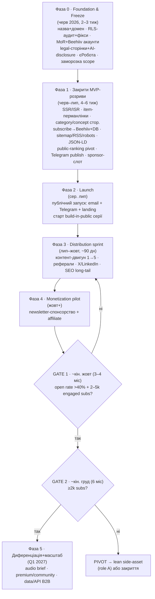

# 07 — AI Brief · MVP Dev Handoff (фінальна специфікація)

> **Що це.** Єдиний документ для передачі проєкту **AI Brief** (робоча назва, AI-News scraper) команді розробки. Зводить твій research (`05 — AI News`) і зведену оцінку трьох інвесторів (`deep-research-report-ai-news.md`) у фінальний флоу запуску MVP: сторінки, фічі, база даних Supabase, SEO та інтеграції.
>
> **Статус коду.** Бекенд-пайплайн `fetch→rank→summarize→publish` живий (Supabase `mdiqfatpqczwqghwttpm`, 649 articles / 6 briefs / 60 brief_items). UI-прототип (Home + All news, React/TSX) готовий як click-through на mock-даті. **MVP = з'єднати ці два шари + закрити дистрибуцію/монетизацію/legal/SEO.**
>
> Дата: 2026-06-01 · Аудиторія: фронтенд+бекенд інженери, хто доводитиме прототип до прод-MVP.

---

## 0. TL;DR — рішення на одній сторінці

1. **Що будуємо.** Не «новинний портал про AI», а **вузький щоденний curated AI/dev brief** (EN+UK) для україно/англомовних інженерів, AI-практиків і tech-лідів. 5–10 курованих items на день, кожен із «чому це важливо» + лінк на першоджерело.
2. **Головний висновок порівняння.** Твій research і троє інвесторів збігаються на **~85%** і **майже дослівно** — на decision gate. Єдина суттєва розбіжність — *роль* продукту (side-asset проти самостійного бізнесу). MVP вирішує її дизайном **«lean-standalone»**: операційно дешевий як side-asset, але з trust+distribution+monetization-каркасом, щоб вирости в самостійний продукт, якщо спрацює сигнал.
3. **Справжній виклик — не код.** Технологія готова на ~70%. Виклик: **дистрибуція (email-список), довіра (AI-disclosure + людське кураторство), платежі (MoR, бо Stripe ⛔ в UA) і legal (AI Act art. 50 застосовується з 02.08.2026 — прямо у вікні запуску).**
4. **Гроші.** Зовнішнє фінансування зараз не потрібне і не радиться (інвестор 2 — «проти зараз»). Bootstrapped, OPEX ~$35–139/міс. Якщо гроші й беруться (єРобота ~$6k) — у **маркетинг/legal, не в розробку**.
5. **Decision gate (спільний для обох джерел).** ~3–4 міс після запуску: **open rate >40% + 2–5k engaged subs**. 6 міс: **<2k subs → pivot у lean side-asset або закриття**; є traction → premium/community → data/API.

**Що команді робити першим (P0):** SSR/ISR-рендер + сторінки-перманлінки одного item (зараз їх немає — це блокер SEO) · реальний newsletter (Beehiiv) + збереження email у БД · RLS-аудит і фікс security-advisors · AI-disclosure + legal-сторінки · sitemap/news-sitemap/robots/RSS · MoR-ready checkout.

---

## 1. Глибокий порівняльний аналіз: `05 — AI News` vs троє інвесторів

### 1.1 Методологія

Порівнюються два незалежні шари: **(A)** твій внутрішній research `05 — AI News (повний шлях)` — продуктово-тактичний, прив'язаний до твоєї кар'єрної цілі (AI Product Engineer) і до сусіднього проєкту Study Platform; **(B)** зведений звіт трьох інвесторів — ринково-фінансовий, який оцінює AI-News **ізольовано**, не знаючи про Study Platform. Це пояснює головну розбіжність нижче.

### 1.2 Точки збігу (сильні сигнали — приймаємо без додаткової валідації)

Коли два незалежні джерела сходяться, це найнадійніша основа для рішень. Вони збігаються на:

| # | Спільна теза | `05 — AI News` | Інвестори |
|---|---|---|---|
| 1 | **Ніша/вертикаль, не масове медіа** | dev/vibe-coding + UA-wedge | «звузити до одного сегмента» (інв. 3) |
| 2 | **Виклик — дистрибуція й довіра, не код** | «тех не проблема (~70%), проблема — distribution+платежі+moat» | «bottleneck — не продукт, а distribution» (інв. 2) |
| 3 | **Спонсорство — перше джерело доходу** | sponsorship → affiliate → premium → data/API | той самий порядок (інв. 1, 2) |
| 4 | **Moat — кураторство, не генерація** | «справжні рови: швидкість/консистентність, бренд, email-список» | «curation moat важливіший за генерацію» (інв. 1) |
| 5 | **Email (owned) + Telegram ядро; SEO — вторинний compounding** | ROI-рейтинг каналів | distribution-first, SEO як compound (інв. 1, 2) |
| 6 | **Платежі через MoR (Stripe ⛔ UA)** | LemonSqueezy/Paddle | LemonSqueezy/Paddle як Merchant of Record (інв. 2) |
| 7 | **Decision gate — майже ідентичні цифри** | <2000 subs за 6 міс → pivot/role A | >40% open + 2–5k subs (3–4 міс); <2k за 6 міс → pivot/close (інв. 2) |
| 8 | **Lean / низький OPEX** | ~$35–80/міс | ~$75–139/міс tool-OPEX; break-even ~17–31 платних (інв. 1, 2) |
| 9 | **Model router: Gemini Flash + Qwen + Bedrock $200** | здешевлення пайплайна | Qwen2.5 + Bedrock для cost-optimization (інв. 2) |

**Збіг на пункті 7 — найважливіший:** дві незалежні аналітики назвали *ті самі* числа decision-gate. Це означає, що цей gate можна вважати валідованим і вшити його прямо в продуктову аналітику з першого дня.

### 1.3 Розбіжності (тут фаундер має узгодити — і ось як MVP це робить)

| # | Розбіжність | `05 — AI News` | Інвестори | **Синтез для MVP** |
|---|---|---|---|---|
| 1 | **Роль продукту** *(головна)* | Нахил у **role A — lean side-asset**, що живить бренд/воронку Study Platform | Самостійний **bootstrapped-актив**, який може стояти сам (інв. 1 «strong buy as asset»; інв. 3 «фінансувати, якщо ніша+ком'юніті») | **«Lean-standalone».** Будуємо дешево (як side-asset), але з повним trust/distribution/monetization-каркасом, щоб MVP не закривав шлях у самостійний бізнес. Розвилку вирішує decision gate (6 міс), а не припущення зараз. |
| 2 | **Вага legal/compliance** | Згадано RLS+MoR, але AI Act/GDPR/copyright — поверхово | Окремий workstream: AI Act art. 50, GDPR, ToS/privacy, copyright, Google scaled-content-abuse | **Додаємо legal-лінію в MVP.** AI Act art. 50 (machine-readable маркування AI-контенту) застосовується **02.08.2026** — у вікні запуску. Disclosure — обов'язок, не «потім». |
| 3 | **Довіра ↔ disclosure** | Не розглянуто trade-off | Емпірика: disclosure знижує trust/підписку, але підвищує source-checking | Disclosure **коротке + людський редактор на виду + видимі джерела** (не великий банер «AI-generated»). Вшито в E-E-A-T-байлайн. |
| 4 | **Диференціація: аудіо vs відео** | `video_script`/`youtube_url`, тижневе відео; обережно з авто-shorts (YouTube банить inauthentic-AI) | **Audio brief (Respeecher)** як retention-гачок, нижчий ризик | Поза MVP. У фазі диференціації **аудіо пріоритетніше** за авто-shorts (нижчий ризик бану, формує звичку). |
| 5 | **Амбіція/фінансування** | Bootstrapped, гранти (єРобота) | Інв. 2 «не зараз»; інв. 3 «умовно, гроші в маркетинг/legal» | Без зовнішніх грошей до traction. Якщо беруться — **у growth/legal, не в dev** (пайплайн готовий). |
| 6 | **Глибина тактики** | Threads-хаки: «1→5» контент-двигун, hook→retention→reward→cta, build-in-public | Ринкові бенчмарки, break-even-математика, виручка конкурентів | Комплементарні — **зливаємо обидва** в GTM. |

### 1.4 Що кожне джерело додає унікального

**Тільки в `05`:** dual-pipeline архітектура (сайт = масовий ranking, Telegram = персональний); конкретна public-ranking-формула; прив'язка до кар'єри AI PE й до Study Platform як top-of-funnel; готові Threads-тактики зростання; шортліст назв (**Latent ⭐**); українські реалії оплати (ФОП 3 гр. 5%, єРобота, Atlas).

**Тільки в інвесторів:** масштаби конкурентів (Rundown 2M, TLDR 1.6M, Superhuman 1M); падіння referral-трафіку медіа **−43% за 3 роки** (аргумент проти SEO-first); емпіричне дослідження довіри до AI-disclosure; AI Act art. 50 + Google scaled-content-abuse як прямі продуктові обмеження; break-even математика (~17–31 платний підписник на tool-only); audio-диференціація (Respeecher); B2B-sponsorship від HR/edu/IT як перший дохід.

### 1.5 Вердикт порівняння

Конфлікту стратегій **немає** — є один багатший консенсус. Запускати **вузький, дисциплінований, trust-driven UA/EN AI-dev brief** як lean-standalone, distribution-first, з вшитим decision-gate і legal-лінією. Технологія — не ризик; ризик — аудиторія, довіра й виконавська концентрація на одному фаундері (тому частину комунікацій/контенту варто винести на фрілансера, як радить інвестор 3).

---

## 2. Фінальний флоу руху до мети (запуск MVP)

Фази нижче поєднують distribution-moat (інв. 1), жорсткі traction-gates (інв. 2), legal/community-readiness (інв. 3) і твій dual-pipeline (`05`). Дати — орієнтовні, від 2026-06-01.

**Текстом, по фазах:**

- **Фаза 0 — Foundation & Freeze (черв 2026).** Обрати назву (рек. **Latent**) + купити домен; RLS-аудит і фікс security-advisors (див. §5.5); ротація ключів; завести MoR (LemonSqueezy) і Beehiiv; чернетки Privacy/ToS/AI-disclosure; подати єРобота; **заморозити MVP-scope** (§3–§4).
- **Фаза 1 — Закрити розриви (черв–лип).** Головне інженерне навантаження. SSR/ISR-рендер; сторінки одного item (перманлінки) — критичні для SEO; category/concept-хаби; форма підписки → Beehiiv API + запис у `subscribers`; sitemap+news-sitemap+robots+RSS; per-page JSON-LD; pivot ranking з «персонального» на «масовий» (формула в `05`); `publish-telegram`; нативний sponsor-слот.
- **Фаза 2 — Launch (сер. лип).** Публічний запуск трьох каналів одночасно (landing + email + Telegram). Старт щоденного build-in-public.
- **Фаза 3 — Distribution sprint (лип–жовт).** Контент-двигун «1 бриф → X-тред + LinkedIn + dev.to + Telegram + фрагмент»; реферальна петля Beehiiv; select-paid тести.
- **Фаза 4 — Monetization pilot (жовт+).** Newsletter-спонсорство (продаємо impressions/CTR із власної GA4-аналітики) + affiliate з `tools_mentioned`.
- **GATE 1 (~кін. жовт).** Не пройшов поріг — лишаємось у distribution-спринті, не пушимо монетизацію.
- **GATE 2 (~кін. груд, 6 міс).** **<2k subs → pivot у role A (lean side-asset для бренду/воронки) або закриття.** Є traction → Фаза 5.
- **Фаза 5 — Диференціація (Q1 2027).** Audio brief (Respeecher), premium/community ($5–9/міс, лише після 10k+ engaged), гіпотеза data/API B2B.

---

## 3. Сторінки та інформаційна архітектура MVP

### 3.1 Поточний стан прототипу

Прототип (`prototypes/`, React/TSX, mock-дата, **без бекенду**) реалізує **2 екрани**: **Home** (`HomePrototype.tsx`) і **All news** (`AllNewsPrototype.tsx`), плюс shell (header з пошуком/мовою/темою, footer), сайдбар-фільтри, картку поста з розкриттям, і 6 фіч F1–F6. Усе двомовне (UK default / EN), повна GA4-інструментація, JSON-LD, A/B-каркас. **Дані ще не з'єднані з Supabase** — форми/збереження працюють на mock/локальному стані.

### 3.2 Цільовий sitemap MVP

Маршрутизація: `/{lang}/...`, `lang ∈ {uk, en}`, `uk` — дефолт. Кожна сторінка має канонічний URL + `hreflang`-пару uk↔en (див. §6).

| # | Сторінка | Маршрут | Стан | Призначення | SEO-роль | Пріор. |
|---|---|---|---|---|---|---|
| 1 | **Home** | `/{lang}` | ✅ прототип | Продуктовий h1, пошук, топ-6 категорій, топ тижня, відео-тизер, FAQ | Organization + WebSite + ItemList | — |
| 2 | **Усі новини / архів** | `/{lang}/news` | ✅ прототип | Пагінований фід з пошуком, фасетами, сортуванням | ItemList, пагінація `rel=next/prev` | — |
| 3 | **Сторінка одного item (перманлінк)** | `/{lang}/news/{item-slug}` | ❌ **немає — блокер SEO** | Повний матеріал: deep_dive, why_matters, takeaways, sources, tools | **NewsArticle/Article** + Breadcrumb | **P0** |
| 4 | **Денний бриф** | `/{lang}/brief/{slug}` | ⚠️ дані є (`briefs.slug`), стор. немає | Канонічний денний продукт = добірка items за дату | CollectionPage + ItemList | **P0** |
| 5 | **Категорія** | `/{lang}/category/{slug}` | ⚠️ маршрут згадано | Хаб теми (9 категорій), фільтрований фід | CollectionPage + ItemList | P1 |
| 6 | **Concept-хаб** | `/{lang}/concepts/{slug}` | ⚠️ є в прод. (26 concepts) | Hub-and-spoke (F4): усі матеріали по концепту | CollectionPage, внутр. лінкування | P1 |
| 7 | **Результати пошуку** | `/{lang}/search?q=` | ⚠️ інлайн, окремої стор. немає | Повна видача (RPC `search_brief_items` існує) | `noindex` (або canonical на категорію) | P1 |
| 8 | **Підписка (landing)** | `/{lang}/subscribe` | ❌ немає (F1 — лише форма) | Конверсійна стор.: цінність + social proof + форма | індексувати, конверсійна | P1 |
| 9 | **Про нас / методологія** | `/{lang}/about` | ❌ немає | Хто курує, як, **AI-disclosure-політика**, джерела | **E-E-A-T core** (автор, прозорість) | **P0** |
| 10 | **Реклама / спонсорам** | `/{lang}/advertise` | ❌ немає | Media kit, інвентар, метрики, контакт | індексувати, продаж sponsorship | P1 |
| 11 | **Legal** | `/privacy`, `/terms`, `/ai-disclosure` | ❌ немає | GDPR privacy, ToS, **AI Act art. 50 disclosure** | індексувати (footer-лінки) | **P0** |
| 12 | **RSS / Atom** | `/rss.xml` (+ `/{cat}/rss.xml`) | ❌ немає | Дистрибуція + machine-readable індексація | feed-discovery | **P0** |
| 13 | **Sitemap** | `/sitemap.xml` + **news sitemap** | ❌ немає | Індексація свіжих новин | критично для news | **P0** |
| 14 | **robots.txt** | `/robots.txt` | ❌ немає | Crawl-директиви + посилання на sitemap | критично | **P0** |
| 15 | Збережене (bookmarks) | `/{lang}/saved` | ⚠️ F5 локально | Return-visit loop | `noindex` | P2 |
| 16 | AI Tools Directory | `/{lang}/tools` | ❌ немає | Affiliate-машина з `tools_mentioned` | CollectionPage | P2 |
| 17 | Premium | `/{lang}/pro` | ❌ немає | Платний tier (після 10k+ engaged) | конверсійна | P2 |

**Головний висновок IA:** прототип має лише 2 індексовані типи сторінок. Для новинного SEO/AEO критично, щоб **кожен курований item і кожен денний бриф мали власний індексований URL** (#3, #4) — інакше пошуковику й answer-engine нема що споживати. Це найважливіший P0-розрив сторінкового рівня.

### 3.3 Глобальні елементи (на всіх сторінках)

Header: лого/назва, нав (Home · Усі новини · Категорії), пошук (канонічний — у хедері), перемикач мови (uk/en, оновлює `hreflang`), перемикач теми, кнопка «Збережене» (F5), CTA «Підписатися». Footer: legal-лінки, RSS, соцмережі, AI-disclosure-лінк, перемикач мови. Усе вже є в `Shell.tsx`.

---

## 4. Беклог фіч: що є, чого бракує

### 4.1 Статус 6 research-фіч (F1–F6) — UI готовий, бекенд ні

| Фіча | UI у прототипі | Чого бракує для прод | Пріор. |
|---|---|---|---|
| **F1 · Email-дайджест** (1 поле + social proof + referral) | ✅ Home-банер + інлайн-картка у фіді | Інтеграція **Beehiiv API**, double opt-in, запис у `subscribers`, GA4 `newsletter_subscribe` | **P0** |
| **F2 · Нативний sponsor-слот** (disclosed «Sponsored» + «чому я це бачу») | ✅ у Week-блоці й фіді | Таблиця `sponsors` + `sponsor_placements`, ротація/таргет, click-tracking, disclosure | P1 |
| **F3 · SEO FAQ + FAQPage JSON-LD** | ✅ акордеон + JSON-LD + контент EN/UK | Майже готово — підставити per-page FAQ, лишити accessibility | P1 (≈done) |
| **F4 · Trending topics → concept hubs** | ✅ зважена хмара тегів (mock) | Реальна агрегація `mentions` з БД, лінк у `/concepts/:slug` | P1 |
| **F5 · Saved stories (bookmarks)** | ✅ drawer + локальний стан | Персист: MVP — `localStorage`; пізніше — `saved_items`+auth | P2 |
| **F6 · Structured data + E-E-A-T** | ✅ Organization/ItemList/Breadcrumb JSON-LD, байлайн | Per-item **NewsArticle**, реальні author/freshness/«sources cited» | **P0/P1** |

### 4.2 Відсутні фічі (поза прототипом) — пріоритезовано

**P0 — блокери запуску:**

- **Newsletter end-to-end** (Beehiiv): форма → double opt-in → `subscribers` → welcome-лист; сегменти (Усі / Dev / UA).
- **Telegram publish** (`publish-telegram`): персональний пайплайн з `05` → Bot API; запис у `social_posts`.
- **Editorial approval / human-in-the-loop**: проста адмін-в'юха `briefs.status: draft→published`. Це одночасно **curation moat**, вимога **AI Act** (людський нагляд) і дисципліна «публікувати вибране, не 80 стор./день».
- **AI-disclosure UI** + legal-сторінки (див. §6.6).
- **Public-ranking pivot**: формула з `05` (engagement_velocity 0.30 · cross_source 0.22 · authority 0.18 · recency 0.15 · inbrief 0.10 · breadth 0.05); прибрати персональні keyword-и.

**P1 — одразу після запуску / монетизація:**

- **Sponsor management** (таблиці §5), media-kit-сторінка, click/impression-трекінг.
- **Affiliate**: реферальні лінки з `tools_mentioned` + сторінка AI Tools Directory.
- **Category + concept-сторінки** повністю на даних.
- **Share-меню** (X / LinkedIn / copy) — вже provisioned у картці.
- **Referral-петля** (Beehiiv referrals) — ~32% конверсія за ~$0.17/sub.
- **Content-engine helper**: внутрішній скрипт «1 бриф → X-тред + LinkedIn + dev.to + Telegram».

**P2 — після gate / диференціація:**

- Персист Saved + сторінка `/saved`; коментарі (provisioned «soon»); **семантичні рекомендації (pgvector)**; **audio brief (Respeecher)**; **premium/paywall (MoR)**; data/API B2B; тижневе відео.

---

## 5. База даних (Supabase)

> Проєкт: **`ai-news-scrapper`** · ref `mdiqfatpqczwqghwttpm` · Postgres 17 · регіон eu-west-1. Повна готова до запуску міграція — у файлі **`07a — Supabase MVP migration.sql`** (DDL + RLS + фікси advisors). Нижче — дизайн і наміри.

### 5.1 Поточна схема (як є, 14 міграцій)

| Таблиця | Рядків | Призначення | Ключові поля |
|---|---|---|---|
| `articles` | 649 | Сирий ingest із джерел | `url` (unique), `source_name`, `published_at`, `raw` jsonb, `hn_score`, `reddit_score`, `mentions_count`, `composite_score`, `inbrief_score` |
| `briefs` | 6 | Денний випуск | `date` (unique), `slug`, `title_en/uk`, `intro_en/uk`, `status` (draft/published), `published_at` |
| `brief_items` | 60 | Опубліковані одиниці (1–10 на бриф) | `brief_id`, `article_id`, `rank`, `summary/why_matters/title/deep_dive _en/uk`, `takeaways`, `tools_mentioned`, `social_hook`, `video_script`, `youtube_url`, `category_slug`, `slug`, `search_tsv_en/uk` (generated FTS) |
| `categories` | 9 | Таксономія | `slug` (PK), `name/description _en/uk`, `color`, `position` |
| `concepts` | 26 | Concept-хаби (F4) | `slug` (PK), `name/description _en/uk`, `type`, `category`, `aliases[]` |
| `pipeline_runs` | 67 | Спостережуваність пайплайна | `date`, `stage`, `status`, `duration_ms`, `meta` |

Функції: `search_brief_items`, `search_facets` (RPC для пошуку/фасетів). Розширення встановлені: `pgcrypto`, `uuid-ossp`, `pg_trgm`, `pg_stat_statements`, `supabase_vault`. Доступні, але не ввімкнені й корисні нам: **`vector` (pgvector 0.8.0)**, **`pg_cron`**, **`pg_net`**, **`pgmq`**.

### 5.2 Розриви (чого бракує для MVP)

Немає таблиць під **монетизаційний актив №1 — email-список**, спонсорів, соц-публікації, аналітику розсилок, семантику та (пізніше) користувачів/коментарі. Це прямо суперечить тезі обох джерел, що email-список — головний оборонний рів. Закриваємо:

### 5.3 Нові таблиці

**P0 (потрібні до запуску):**

- **`subscribers`** — ядро бізнесу. `id`, `email` (citext, unique), `lang`, `segment` (all/dev/ua), `status` (pending/active/unsubscribed/bounced), `source`, `placement`, `referral_code` (unique), `referred_by`, `beehiiv_id`, `confirmed_at`, `created_at`, `unsubscribed_at`, `ip_country` (GDPR-мінімум). **RLS:** анонім **не читає** і **не пише напряму** — підписка йде через Edge Function із `service_role` (валідація + виклик Beehiiv + double opt-in). Так email-база не світиться через anon-ключ (урок CVE з `05`).
- **`newsletter_sends`** — аналітика розсилок: `brief_id`, `beehiiv_post_id`, `segment`, `sent_at`, `recipients`, `opens`, `clicks`, `status`. Живить North-Star (open rate >40% — decision gate). **RLS:** лише service_role.
- **`social_posts`** — трекінг Telegram/X/LinkedIn: `brief_id`, `brief_item_id`, `channel`, `external_id`, `url`, `status`, `posted_at`, `meta`. Сюди пише `publish-telegram`. **RLS:** публічне читання опублікованих, запис service_role.

**P1 (монетизація):**

- **`sponsors`** — `id`, `brand`, `color`, `logo_url`, `contact_email`, `notes`, `created_at`. **RLS:** лише service_role.
- **`sponsor_placements`** — `id`, `sponsor_id`, `slot` (home_week/feed/email/item), `lang`, `starts_on`, `ends_on`, `headline_en/uk`, `body_en/uk`, `cta_en/uk`, `url`, `impressions`, `clicks`, `active`. **RLS:** анонім читає лише активні (`active AND now() BETWEEN starts_on AND ends_on`), запис service_role. Замінює хардкод `SPONSOR` у прототипі (F2).

**P2 (після gate / диференціація):**

- **`profiles`** — `id` → `auth.users`, `display_name`, `lang_pref`, `created_at`. **RLS:** власник.
- **`saved_items`** — `user_id`, `brief_item_id`, `created_at`. **RLS:** власник. (MVP — bookmarks у `localStorage`, без БД.)
- **`comments`** — `id`, `brief_item_id`, `user_id` (nullable), `author_name`, `body`, `status` (pending/approved/spam), `created_at`. **RLS:** публічне читання `approved`, вставка з модерацією.
- **`brief_item_embeddings`** — `brief_item_id` (PK→brief_items), `embedding vector(1536)`, `model`, `created_at`; HNSW-індекс. Семантичні рекомендації + дедуплікація. Потребує `create extension vector`. **RLS:** лише service_role (читання — через RPC).

### 5.4 Зв'язки (нові FK)

`subscribers.referred_by → subscribers.id` · `newsletter_sends.brief_id → briefs.id` · `social_posts.brief_id → briefs.id`, `social_posts.brief_item_id → brief_items.id` · `sponsor_placements.sponsor_id → sponsors.id` · `saved_items/comments.brief_item_id → brief_items.id` · `brief_item_embeddings.brief_item_id → brief_items.id`.

### 5.5 Безпека — обов'язкове до запуску (з live security-advisors)

Поточний `get_advisors(security)` повертає 4 пункти — закрити у Фазі 0:

1. **`pipeline_runs`: RLS увімкнено, але без політики.** Зараз доступ закрито для anon (ок), але треба явно зафіксувати намір — лишити **internal-only** (читання тільки service_role). Додати коментар-політику `using (false)` для anon/authenticated.
2. **Mutable `search_path` у `search_brief_items` і `search_facets`** (WARN, security). Фікс: `ALTER FUNCTION public.search_brief_items(...) SET search_path = public, pg_temp;` (аналогічно для `search_facets`).
3. **`pg_trgm` у схемі `public`** (WARN). Перенести: `ALTER EXTENSION pg_trgm SET SCHEMA extensions;` ⚠️ перевірити залежні індекси перед застосуванням.
4. **RLS-аудит читання (урок CVE з `05`: 303 endpoints читались через anon-ключ).** Anon має читати **тільки опублікований контент**: `brief_items` лише там, де батьківський `briefs.status = 'published'`; `articles` (сирий ingest) **взагалі не віддавати анону** — лише через `brief_items`. Перевірити наявні політики на `articles/briefs/brief_items/categories/concepts` і звузити до published-only. `service_role` — **ніколи** в клієнті; усі записи (subscribe, sponsor, social, sends) — через Edge Functions.

Після будь-яких DDL-змін — повторно прогнати `get_advisors(security)` і `get_advisors(performance)`.

---

## 6. SEO та технічні вимоги (включено в налаштування MVP)

> Контекст із research: інвестори фіксують падіння referral-трафіку медіа на **−43% за 3 роки** → SEO не в центрі, але це безкоштовний compounding-канал, і його треба зробити **правильно з першого дня**. Прототип уже має JSON-LD, per-view meta й CWV-бюджети — лишається перенести це на справжній рендер і реальні сторінки.

### 6.1 Рендеринг — головна технічна зміна (P0)

Прототип — **CSR (Vite SPA)**. Для новин це погано: пошуковику потрібен готовий HTML і свіжість. **Перейти на SSR/ISR.**

- **Рекомендація: Next.js (App Router)** — найкращий ISR / on-demand revalidation, нативний Metadata API, i18n-роутинг, news-sitemap. Денний бриф і items ревалідуються по завершенню пайплайна (webhook → `revalidateTag`).
- Альтернатива (якщо лишатись ближче до поточного стека): **React Router 7** або **Vite + prerender** — звірити з твоїми Cursor-rules. Це рішення архітектора (див. §9 — відкрите).

### 6.2 Per-page metadata (на кожній сторінці, не глобально)

`<title>`, `meta description`, **canonical**, OpenGraph (`og:title/description/image/type`), Twitter card, `<html lang>`. Денний бриф/item: `article:published_time`, `article:modified_time`. OG-зображення — генерувати динамічно (категорійний banner-motif із прототипу як шаблон).

### 6.3 hreflang / i18n

`/uk/` (дефолт) і `/en/`; на кожній сторінці `<link rel="alternate" hreflang="uk|en|x-default">` із канонічними парами. Пайплайн уже двомовний → marginal cost другої мови низький.

### 6.4 Структуровані дані (JSON-LD) — розширити F6

| Сторінка | Schema.org типи |
|---|---|
| Home | `Organization` + `WebSite` (з `SearchAction`) + `ItemList` |
| **Item-перманлінк** | **`NewsArticle`**: `headline`, `datePublished`, `dateModified`, `author`, `publisher`, `image`, `description`, `isBasedOn`/`citation` → першоджерело |
| Денний бриф | `CollectionPage` + `ItemList` |
| Категорія / Concept | `CollectionPage` + `ItemList` + `BreadcrumbList` |
| FAQ (F3) | `FAQPage` ✅ |
| Усі | `BreadcrumbList` ✅ |

### 6.5 Crawl-інфраструктура (P0)

- **`robots.txt`** — allow, посилання на sitemap.
- **`sitemap.xml`** (індекс) + **Google News sitemap** (статті < 48 год, тег `news:publication`, мова) + per-lang.
- **RSS/Atom** — сайт + per category (дистрибуція + feed-discovery).

### 6.6 E-E-A-T + AI-disclosure (довіра + legal разом)

- Видимий **байлайн куратора/автора + дата свіжості + «sources cited»** (F6 вже закладає) і сторінка **About/методологія** (§3, #9).
- **AI-disclosure (P0):** коротке, зрозуміле, **machine-readable** маркування AI-участі — вимога **EU AI Act art. 50**, що застосовується **02.08.2026** (у вікні запуску). Для згенерованих медіа врахувати C2PA/метадані.
- ⚠️ **Нюанс із дослідження інвесторів:** надмірний disclosure *знижує* trust і підписку. Тому — **не лякливий банер «AI-generated»**, а спокійна нотатка + видиме людське редагування + лінки на джерела. Disclosure як знак якості, не дисклеймер.

### 6.7 Контент-дисципліна проти SEO-демоції (P0-політика)

Google **scaled content abuse** карає масову неоригінальну AI-генерацію/scraping без доданої цінності. Тому: **обробляти 80+ матеріалів усередині, а публікувати вибране** — денний бриф + куровані items із реальною доданою цінністю (`why_matters`, `takeaways`, людськи відредаговані title/intro). **Не** автогенерувати десятки тонких сторінок на день. Це водночас захищає SEO, виконує AI Act і будує curation-moat (збіг усіх джерел, §1.2 п.4).

### 6.8 Performance / Core Web Vitals (ціль прототипу — тримати в проді)

Lighthouse (mobile): **Performance ≥90 · Accessibility ≥95 · Best Practices ≥95 · SEO 100.** Бюджети CWV: **LCP ≤2.0s · INP ≤200ms · CLS ≤0.05 · FCP ≤1.5s · TTFB ≤0.8s.** `web_vitals`-події вже інструментовані (`webVitals.ts`). SSR/ISR покращує TTFB/LCP — ще аргумент за §6.1.

### 6.9 Аналітика (GA4 — вже специфіковано в `ANALYTICS.md`)

Увімкнути одним env (`VITE_GA_MEASUREMENT_ID` / еквівалент у Next). **North-Star:** weekly engaged readers (сесії з ≥1 `post_expand` або `scroll_depth ≥75`). **Key events:** `newsletter_subscribe` (головний), `post_expand`, `select_search_result`, `sponsor_click`, `save_toggle`. Consent Mode v2, A/B через `experiments.ts`. Guardrails: `search_no_results`, `web_vitals` poor-rate. Ці метрики прямо живлять decision gate (§2).

---

## 7. Інтеграції та стек

| Шар | Рішення | Нотатки |
|---|---|---|
| **Newsletter** | **Beehiiv** (free до 2500 → Scale $43) | Ad network, referrals, 0% take rate. Welcome/confirm — Beehiiv automations або **Resend** для transactional. |
| **Telegram** | **Bot API** | Персональний пайплайн із `05`; запис у `social_posts`. Низький ризик бану. |
| **Платежі** | **MoR: LemonSqueezy** (або Paddle), ~5%+$0.50 | **Stripe ⛔ напряму в UA.** Beehiiv-платні підписки йдуть через Stripe → MoR-обхід або US LLC (Atlas $500+$100/рік) при масштабі. Webhook: **підпис + idempotency**. ФОП 3 гр. 5%. |
| **LLM-роутер** | **Gemini Flash-Lite/Flash** (default) · **Qwen2.5** (cost/fallback, ~9× дешевше) · **Bedrock** ($200 кредити, multi-model) | Уже у пайплайні; винести вибір моделі в конфіг. |
| **Хостинг** | **Vercel** Pro $20 (SSR/ISR) + **Cloudflare** (DNS/CDN, free) | |
| **БД/Backend** | **Supabase** Pro $25 | Edge Functions для subscribe/sponsor/webhooks; cron 06:00 (зовнішній або `pg_cron`+`pg_net`). |
| **Аудіо (P2)** | **Respeecher** (~$2/год TTS) | Audio brief у фазі диференціації. |

**Env (орієнтовно):** `SITE_URL` · `SUPABASE_URL` · `SUPABASE_ANON_KEY` · `SUPABASE_SERVICE_ROLE_KEY` *(тільки сервер)* · `GEMINI_API_KEY` · `DASHSCOPE_API_KEY` (Qwen) · `AWS_*` (Bedrock) · `BEEHIIV_API_KEY` + `BEEHIIV_PUBLICATION_ID` · `TELEGRAM_BOT_TOKEN` + `TELEGRAM_CHANNEL_ID` · `LEMONSQUEEZY_API_KEY` + `LEMONSQUEEZY_WEBHOOK_SECRET` · `GA4_MEASUREMENT_ID`.

**Бюджет MVP:** ~$35–139/міс tool-OPEX (Supabase $25 + Vercel $20 + домен + LLM $5–65 + Beehiiv free→$43). Break-even на premium ($5/міс) ≈ 17–31 платний підписник (tool-only). 100k користувачів ≈ $600–1200/міс.

---

## 8. Definition of Done та decision gate

### 8.1 MVP «готово до запуску» (усі P0)

- [ ] **Рендер SSR/ISR**; денний бриф та items мають **індексовані перманлінки**.
- [ ] **Дані з Supabase** замінили mock (`data.ts`); типи з `generate_typescript_types`.
- [ ] **Підписка end-to-end**: форма → Edge Function → double opt-in → `subscribers` → welcome; GA4 `newsletter_subscribe`.
- [ ] **Telegram** автопостить денний бриф; запис у `social_posts`.
- [ ] **Editorial approval**: бриф проходить `draft → published` людиною (curation moat + AI Act).
- [ ] **Public ranking** перемкнено на масову формулу (`05`).
- [ ] **SEO-інфра**: `robots.txt`, `sitemap.xml` + news-sitemap, RSS, per-page JSON-LD (вкл. `NewsArticle`), hreflang.
- [ ] **Legal**: Privacy, ToS, **AI-disclosure (machine-readable, AI Act art. 50)**, About/методологія.
- [ ] **Security**: міграція `07a` застосована, RLS-аудит чистий, advisors без WARN, ключі зротовані, `service_role` лише на сервері.
- [ ] **MoR-checkout** технічно готовий (premium можна не вмикати, але білінг не має блокувати gate).
- [ ] **Аналітика**: GA4 live, web-vitals у нормі, Lighthouse цілі досягнуто.

**DoD по суті (з `05`):** AI Brief — самодостатній distribution+portfolio engine з масовим ranking, email+Telegram-дистрибуцією і першим монетизаційним сигналом — **АБО** чіткий, даними підкріплений висновок про роль продукту.

### 8.2 Decision gate (валідований обома джерелами — вшити в GA4 з дня 1)

| Контрольна точка | Поріг | Дія |
|---|---|---|
| **~3–4 міс** після запуску | open rate **>40%** + **2–5k** engaged subs | Продовжувати; запускати sponsorship-pilot |
| **6 міс** | **≥2k** subs | → premium/community → data/API |
| **6 міс** | **<2k** subs | → **pivot у lean side-asset (role A) або закриття** |
| будь-коли | premium-конверсія <1% | лишатись на sponsorship+affiliate |
| будь-коли | UK росте швидше за EN | подвоїти UA (role C — UA-wedge) |

---

## 9. Відкриті рішення (за фаундером/архітектором)

1. **Назва + домен.** Рекомендація research — **Latent** (ML-термін, кредибельно для dev). Перевірити доступність домену (є MCP-інструмент) — не блокує Фазу 1.
2. **Фреймворк рендера.** Next.js (рек.) vs React Router 7 vs Vite+prerender — звірити з Cursor-rules. Рішення архітектора.
3. **Роль продукту (амбіція).** MVP робимо «lean-standalone»; фаундер підтверджує вагу «дохід/амбіція» — від цього залежить, наскільки агресивно йти в Фазу 5.
4. **Newsletter:** Beehiiv-hosted (рек. для MVP) vs самостійно (Resend + власний рендер).
5. **Auth у MVP?** Рекомендація — **без auth на старті** (анонімно, bookmarks у `localStorage`); auth додати разом із premium/коментарями.
6. **Premium-таймінг:** не раніше 10k+ engaged (узгоджено обома джерелами).

---

## 10. Беклог для команди (epics → задачі)

**EPIC A — Рендер та IA.** Перехід на SSR/ISR; маршрути `/{lang}/news/{slug}`, `/brief/{slug}`, `/category/{slug}`, `/concepts/{slug}`, `/subscribe`, `/about`, `/advertise`, legal; on-demand revalidate по завершенню пайплайна.

**EPIC B — Data layer.** Замінити `data.ts` mock на Supabase-запити; згенерувати TS-типи; під'єднати `search_brief_items`/`search_facets`; published-only читання.

**EPIC C — Newsletter.** Beehiiv-інтеграція; Edge Function subscribe + double opt-in; `subscribers` + сегменти; welcome; referral-код (F1).

**EPIC D — Дистрибуція.** `publish-telegram` + `social_posts`; share-меню (X/LinkedIn/copy); content-engine helper «1→5»; build-in-public шаблони.

**EPIC E — Монетизація.** `sponsors`/`sponsor_placements` + рендер слота (F2) з disclosure + click/impression-трекінг; `/advertise` media-kit; affiliate з `tools_mentioned` + `/tools`.

**EPIC F — SEO/crawl.** `robots.txt`; `sitemap.xml` + news-sitemap; RSS (сайт + категорії); per-page JSON-LD (вкл. `NewsArticle`); hreflang; динамічні OG-зображення; Lighthouse-прогін.

**EPIC G — Legal & trust.** Privacy/ToS/AI-disclosure (AI Act machine-readable); About/методологія; **editorial approval UI** (`briefs.status`); E-E-A-T-байлайн на даних (F6).

**EPIC H — Security & DB.** Застосувати `07a` міграцію; RLS-аудит (published-only, `articles` не для anon); фікс advisors (search_path, pg_trgm, pipeline_runs); ротація ключів; service_role лише сервер.

**EPIC I — Analytics & QA.** GA4 live (Consent Mode v2); web-vitals; перші A/B (`hero_cta`, `newsletter_placement`); QA decision-gate-подій.

---

## Джерела

- `05 — AI News (повний шлях).html` — твій research (роль-матриця, dual-pipeline, ranking-формула, канали, ризики, оплата).
- `deep-research-report-ai-news.md` — зведена оцінка 3 інвесторів (ринок, moat, decision gate, legal, монетизація, break-even).
- `00 — Карта (START HERE).md` — статус і рішення по проєктах.
- Прототип `prototypes/` (React/TSX) + `ANALYTICS.md` — UI, фічі F1–F6, GA4/CWV-критерії.
- Live Supabase `ai-news-scrapper` (`mdiqfatpqczwqghwttpm`) — поточна схема, міграції, security-advisors.

