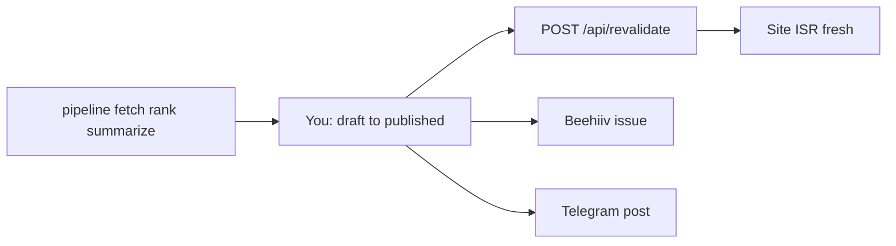

# Launch status — AI Today Brief

Last updated: after **PR #20** merged to `main` (launch prep: SEO, CMP, GA4, Beehiiv subscribe, revalidate hook).

## Done (product + code)

- **Reader UI:** home, news, brief, item, category, concepts (EN/UK, Supabase, ISR)
- **Trust:** about, ai-disclosure, privacy, terms, subscribe, advertise
- **SEO:** robots (AI bots), `sitemap.xml`, `news-sitemap.xml`, RSS, JSON-LD, hreflang
- **Growth:** `/api/subscribe` → Beehiiv (env: `BEEHIIV_API_KEY` + `BEEHIIV_PUBLICATION_ID_API_V2` or aliases)
- **CMP + GA4:** cookie banner, Consent Mode v2, `NEXT_PUBLIC_GA_MEASUREMENT_ID`
- **Ops hook:** `POST /api/revalidate` (needs `REVALIDATE_SECRET`)
- **19+ PRs** through #20 on `main`

## Your env — current (verify after each change)

| Item | Local `.env.local` | Vercel | GitHub `ai-today-brief` | Notes |
|------|-------------------|--------|-------------------------|--------|
| Supabase (site) | ✅ `NEXT_PUBLIC_*` | ✅ via `VITE_SCRAPPER_*` | — | Aliases OK |
| GA4 | ✅ | ✅ | — | After consent in banner |
| Beehiiv | ✅ API + V1 + V2 IDs | ✅ | ✅ (for CI if needed) | **No** Beehiiv custom domain on root |
| Telegram | ✅ | ✅ | ✅ | Used by **news-pipeline**, not Next |
| Pipeline LLM/DB | ✅ | partial | ✅ | Full set in **news-pipeline** repo secrets |
| `REVALIDATE_SECRET` | ❌ | ❌ | ❌ | Add when pipeline publishes |
| Resend | ⬜ empty | ❌ | ❌ | Optional |
| LemonSqueezy | ⬜ empty | ❌ | ❌ | Defer until monetization |

**After merge:** trigger **Vercel Production redeploy** (or wait auto-deploy) → test `/en/subscribe` on live site.

---

## Still on you (launch blockers)

| # | Task | Why |
|---|------|-----|
| 1 | **Redeploy + test Beehiiv** on production | Confirm subscriber in Beehiiv dashboard |
| 2 | **`REVALIDATE_SECRET`** in Vercel | Pipeline → `POST /api/revalidate` after publish |
| 3 | **news-pipeline** run + first `published` brief | [github.com/sanchahous/news-pipeline](https://github.com/sanchahous/news-pipeline) — Telegram secrets there too |
| 4 | **Editorial:** `briefs.status = published` only | Supabase Table Editor until admin UI exists |
| 5 | **Legal sign-off** | Lawyer → `src/lib/legal.ts`, remove `legalDraft` |
| 6 | **Supabase** migration `015` + RLS audit §5 | Security gate |
| 7 | **Search Console** | Submit `sitemap.xml` + `news-sitemap.xml` |
| 8 | **Go-live check** | Same brief: site + Beehiiv send + Telegram channel |

### Deferred (not blocking MVP)

- Resend (if Beehiiv handles double opt-in alone)
- LemonSqueezy / PayPal verification (UA — sponsorship via email first)
- Beehiiv custom domain / root DNS to Beehiiv (**do not**)

---

## Still in code (agent / next PRs)

| # | Task |
|---|------|
| A | Minimal **admin** `draft → published` (+ optional revalidate on publish) |
| B | Wire **news-pipeline** `publish` stage → `/api/revalidate` |
| C | Polish: theme toggle, footer done, dedicated `/search` (optional) |
| D | `sponsors` table → replace demo sponsor card |
| E | Vitest + `pr:check` coverage when logic grows |

---

## Go-live sequence (3 channels)

Service portability: `docs/SERVICES-PORTABILITY.md`.
