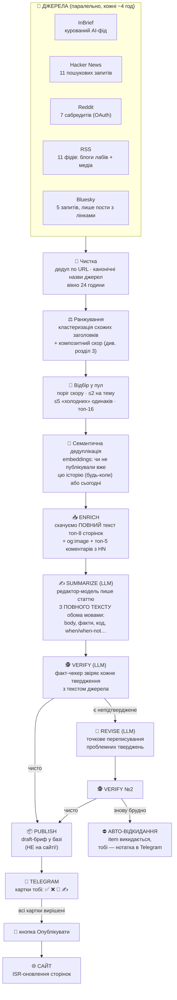
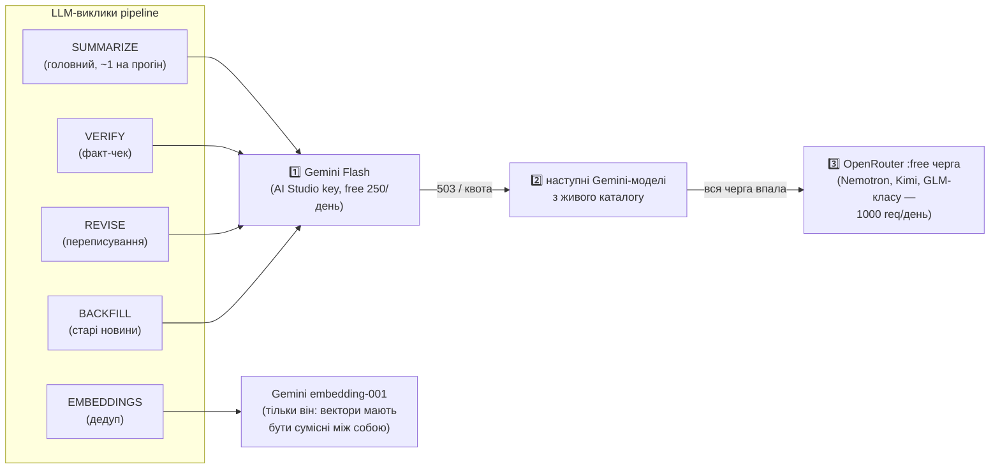
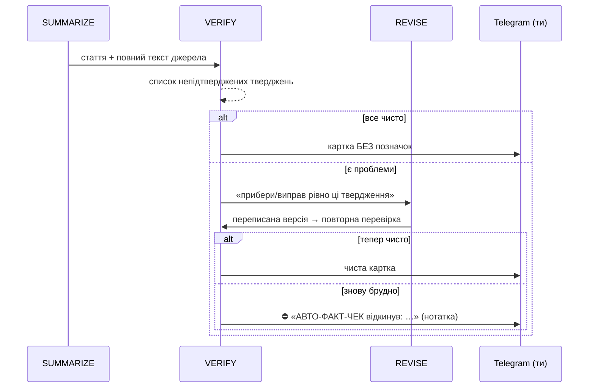
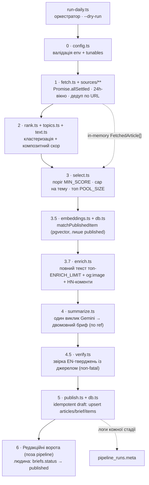
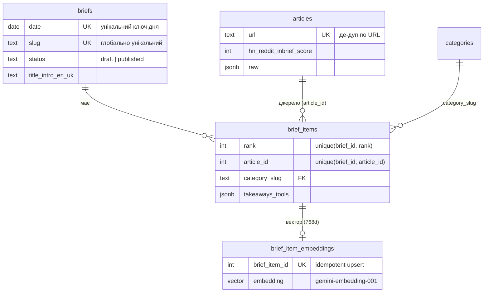

# Як працює AI Today Brief — гайд для власника

Summary: Власникський гайд pipeline: fetch → rank → summarize → publish.
Sources: none (analysis)
Last updated: 2026-06-11

> Цей документ — для тебе, не для розробників. Мета: щоб жодне повідомлення
> бота і жодна цифра в базі не викликали питання «а що це і чому».
> Оновлено: 2026-06-11. Діаграми — mermaid (GitHub рендерить їх автоматично).

---

## 1. Велика картина: шлях новини від інтернету до сайту

**Ключова ідея:** до тебе в Telegram доходить лише те, що вже пройшло
автоматичний факт-контроль. Твоя робота — 10 секунд на картку: «цікаво моїй
аудиторії чи ні». Перевіряти факти руками НЕ треба.

---

## 2. Джерела: хто що дає

| Джерело | Що це | Сигнал | Конверсія* |
|---|---|---|---|
| **InBrief** | Курований AI-фід (через нього приходять GitHub, X, YouTube…) | редакційна оцінка 0–100 | GitHub-релізи: **68%** 🏆 |
| **Hacker News** | 11 пошукових запитів по Algolia | бали + коментарі | 2.7%, але найбільший обсяг |
| **Reddit** | 7 dev-сабредитів | бали + коментарі | r/LocalLLaMA: 21% |
| **RSS** | Блоги Anthropic/OpenAI/DeepMind/… + медіа | — (тільки свіжість) | щойно увімкнено постійно |
| **Bluesky** | Жива dev-дискусія, лише пости з зовнішніми лінками | лайки + репости | нове джерело |

\* конверсія = скільки зібраного дійшло до публікації, за перший місяць.

**Здоров'я джерел:** кожен прогін рахує статус кожної гілки (ok / порожньо /
помилка) аж до окремого RSS-фіда. Якщо щось померло — тобі приходить
«⚠️ ДЖЕРЕЛА НЕДОСТУПНІ» (максимум раз на прогін, не спам). «Порожньо» для
тихих фідів типу блогу Anthropic — це нормально, мертвим вважається лише фід
без записів узагалі.

---

## 3. Шкала відбору: як рахується скор новини

Кожен кластер (групa статей про одну подію) отримує скор 0…1 з шести
компонентів. Теплокарта ваг:

| Компонент | Вага | Що міряє | 🔥 |
|---|---|---|---|
| **velocity** | 0.30 | наскільки ГАРЯЧА зараз (бали/годину з HN+Reddit+Bluesky) | 🟥🟥🟥🟥🟥🟥 |
| **cross-source** | 0.22 | скільки джерел написали про це | 🟥🟥🟥🟥▫️▫️ |
| **authority** | 0.18 | довіра до джерела (таблиця нижче) | 🟧🟧🟧▫️▫️▫️ |
| **recency** | 0.15 | свіжість (напіврозпад 12 год) | 🟧🟧🟧▫️▫️▫️ |
| **inbrief** | 0.10 | редакційна оцінка InBrief | 🟨🟨▫️▫️▫️▫️ |
| **breadth** | 0.05 | різноманіття джерел у кластері | 🟨▫️▫️▫️▫️▫️ |

Довіра до джерел (authority):

| Рівень | Джерела |
|---|---|
| **1.00** | Anthropic, OpenAI, Google AI/Research, DeepMind, Hugging Face, Meta AI, NVIDIA |
| **0.90** | Hacker News, Simon Willison, GitHub, arXiv |
| **0.75** | Ars Technica, MIT Technology Review, TechCrunch |
| **0.70** | Reddit |
| **0.55** | VentureBeat, MarkTechPost, YouTube, X, Threads, **The Verge** (демоутнуто: 33 зібрано / 0 опубліковано), **Bluesky** |
| **0.60** | усе невідоме |

Два спецправила:
- **Official-floor:** блоги рівня 1.00 отримують velocity мінімум 0.5 — щоб
  реліз Anthropic не програвав шумному треду, поки його ще не розігнали.
- **Анти-клікбейт:** «you won't believe», «X says…» тощо ріжуть скор до 70%.

Після скорингу: поріг 0.15 → максимум 2 новини на тему → максимум 5 «холодних
одинаків» (нуль engagement, одне джерело — захист від медіа-шуму) → топ-16 у
пул для LLM-редактора.

> 📊 З цього тижня скор кожної статті зберігається в базі
> (`articles.composite_score`). Через місяць даних зможемо перевірити, які
> ваги передбачають твої ✅/❌, і потюнити шкалу під тебе.

---

## 4. LLM-менеджмент: хто думає і що буде, коли впремось у ліміт

Твоє питання «чому лише Gemini?» — справедливе. Ось повна маршрутизація:

| Шар | Провайдер | Ліміт | Коли вмикається |
|---|---|---|---|
| 1 | **Gemini Flash** (AI Studio) | free 250 req/день | завжди перший |
| 2 | Інші Gemini-моделі | та сама квота | 503/перевантаження першої |
| 3 | **OpenRouter `:free`** (туди входять Nemotron, Kimi, GLM-подібні) | 1000 req/день | вся Gemini-черга вичерпана |

**Чому НЕ підключені напряму:**
- **NVIDIA API / Z.ai GLM** — їхні моделі вже доступні через OpenRouter
  `:free` чергу (шар 3). Окрема інтеграція = дублювання без нової квоти.
- **Codex (ChatGPT Plus)** — підписка працює лише через офіційний CLI на
  твоїй машині; вшивати її в серверний pipeline не можна за умовами
  (твій же orchestration-план це фіксує). Codex — для твоєї
  інтерактивної роботи і оркестратора, не для крону.
- **Claude (Pro)** — те саме: інтерактивний інструмент. Ним ти зараз
  читаєш цей файл 🙂

Бюджет прогону пишеться в `pipeline_runs.meta` (prompt/output токени) — собівартість завжди видно.

---

## 5. Авто-факт-контроль: чому тобі не треба перевіряти руками

Якщо щось таки проскочить (наприклад, VERIFY впав і стаття пішла неперевіреною) — на картці буде жирний рядок **🚨 Авто-перевірка** з деталями. Немає рядка = все звірено.

---

## 6. Твої кнопки в Telegram

| Кнопка | Що робить | Коли тиснути |
|---|---|---|
| ✅ Схвалити | item піде на сайт після 🚀 | стаття цікава аудиторії |
| ❌ Відхилити | сюжет ПОХОВАНО на весь день (дедуп не дасть повернутись) | тема не для нас |
| 🔁 Переробити | картка видаляється, наступний прогін запропонує сюжет заново з новим текстом | тема ок, текст поганий |
| ✍️ Тейк | бот спитає твою думку (2–4 речення) → блок «Думка редактора» на сторінці | хочеш додати людський вердикт |
| 🚀 Опублікувати | весь пак іде на сайт + оновлення сторінок | коли вирішені ВСІ картки (хедер попередить, якщо вище висять старі) |

---

## 7. Що буде, якщо «X впаде»

| Падає | Наслідок | Твоя дія |
|---|---|---|
| Одне джерело | решта працюють; алерт раз на прогін | нічого |
| Один RSS-фід | алерт із назвою фіда | нічого (або виправити URL) |
| Gemini повністю | OpenRouter `:free` підхоплює | нічого |
| І Gemini, і OpenRouter | прогін фейлиться; наступний слот (через 30 хв) пробує знову — 6 спроб на прогін | нічого |
| VERIFY | статті йдуть на рев'ю неперевіреними, але ти бачиш це по відсутності/наявності 🚨 | уважніше глянути картки |
| Telegram | бриф лежить draft'ом у базі, нічого не губиться | `notify-brief.ts` дошле картки |
| GitHub Actions | нема прогонів | запустити вручну (Actions → Run workflow) |

---

## 8. Ручки (env), які можна крутити без коду

| Змінна | Дефолт | Що міняє |
|---|---|---|
| `MAX_ITEMS` | 8 | максимум items в одному брифі |
| `POOL_SIZE` | 16 | скільки кандидатів бачить LLM-редактор |
| `PER_TOPIC_CAP` | 2 | максимум новин на одну тему в пулі |
| `MAX_COLD_SINGLETONS` | 5 | стеля «холодних» медіа-одинаків у пулі |
| `MIN_SCORE` | 0.15 | поріг входу в пул |
| `ENRICH_LIMIT` | 8 | скільком кандидатам качаємо повний текст |
| `VERIFY_CLAIMS` | 1 | `0` = вимкнути факт-контроль (аварійне) |
| `MAX_EMBED_DISTANCE` | 0.12 | чутливість дедуплікації (менше = суворіше); 0.20 викидав ~89% реально нових новин у вузькій ніші |

---

## 9. Глосарій

- **Прогін (progón)** — один цикл pipeline. 6 на день (кожні 4 год Київ), у кожного 4 retry-слоти через 30 хв (вікно 1.5 год); після вдалої публікації решта слотів пропускаються (cycle-guard виходить до `npm ci`).
- **Пак / бриф** — добірка items одного прогону; день може мати кілька паків (editions).
- **Пул** — топ-16 кандидатів, які бачить LLM-редактор.
- **Кластер** — статті різних джерел про одну подію, злиті в одного кандидата.
- **Холодний одинак** — новина без engagement з одного джерела (типово медіа-RSS).
- **Item** — одна новина на сайті (`/uk/<бриф>/<новина>`).
- **Legacy item** — стара новина без rich-полів (факт-контроль не зміг звірити — лишилась у простому форматі; це норма).

---

## 10. Для розробника: точний порядок стадій і модель даних

> Розділи 1–9 — погляд власника. Цей розділ звіряє діаграми з кодом
> (`pipeline/run-daily.ts` + `pipeline/README.md`): один вхід, типізовані
> структури, без mutable state на рівні модулів.

> **Діаграма — Конвеєр стадій із прив'язкою до файлів (flowchart).** Реальний
> порядок, як його виконує `run-daily.ts`: FETCH → RANK → SELECT → DEDUP →
> ENRICH → SUMMARIZE → VERIFY → PUBLISH. Стадії до DEDUP працюють лише в пам'яті
> (`FetchedArticle[]`), запис у Supabase — лише на PUBLISH (draft).

> **Діаграма — Модель даних Supabase (ER).** Чотири таблиці, яких торкається
> pipeline. `articles` — сирий audit-trail (unique `url`); `briefs` — один на
> `date`; `brief_items` — рядки брифа з двомовним текстом; `brief_item_embeddings`
> — вектори опублікованих item-ів для крос-денної семантичної дедуплікації.

Запуск: `npm run pipeline:dry` (fetch + rank + summarize + друк, без запису) або
`npm run pipeline` (плюс запис денного **draft**-брифа). Store — єдине джерело
правди; людина перемикає `briefs.status → published` (редакційні ворота).
