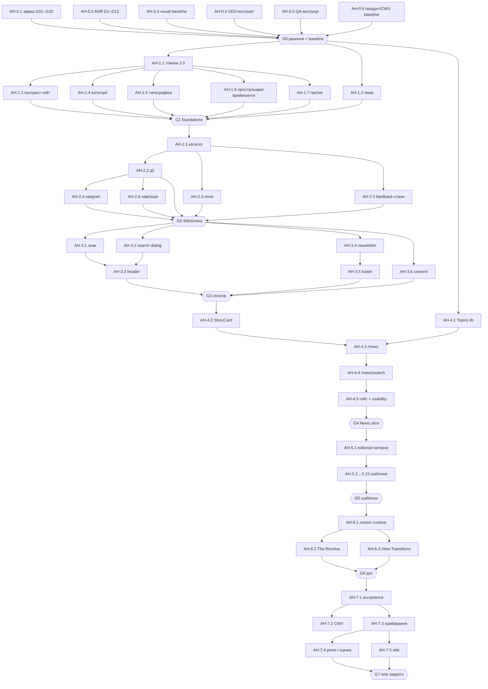

# Епік: реалізація редизайну After Hours (AI Today Brief)

Summary: виконуваний епік переносу дизайн-системи й макетів After Hours v3 з `artifacts/after-hours/` у production-сайт: 54 сабтаски (53 обов'язкові + 1 опційна) у порядку виконання, 8 фаз і 8 гейтів, кожен сабтаск з описом, залежностями й acceptance criteria. Стартує з перевіреного стану коду 2026-09-29 і з рішень D1–D13 (D1, D3, D4, D5 прийняті власником 2026-09-29).
Sources: `artifacts/after-hours/` (README, QA.md, tokens.css, tokens.json, app.js, home.js, articles.js, editions.js, knowledge.js, toolbox.js, pages.js, seo.js, data.js `COVERAGE`, `qa/*.mjs`), `artifacts/after-hours-motion/README.md`, `artifacts/brand-kit/README.md`;
wiki: product/after-hours-redesign, product/after-hours-tension, audits/2026-09-26-design-system-gap-plan, decisions/2026-09-26-news-discovery-and-pagination-architecture, architecture/design-system-tokens, analytics/event-taxonomy, ops/vercel-origin-transfer, ops/supabase-egress-2026-09, now;
live check коду 2026-09-29 (`main` @ `3debff1`): `src/app/globals.css`, `src/app/layout.tsx`, `src/lib/design-system/tokens.ts`, `src/lib/i18n.ts`, `src/lib/category-meta.ts`, `src/components/**`, `src/app/[lang]/**`, `src/proxy.ts`, `e2e/**`, `scripts/e2e-affected.ts`, `wiki/_meta/project-sync.json`; `node_modules/next/dist/docs` (Next 16.3.0)
Last updated: 2026-09-29

---

> **Статус 2026-09-29:** епік готовий до виконання. Перші кроки — AH-0.1 (звірка стану) і AH-0.2
> (підпис рішень D1–D13). До закриття гейту G0 жоден візуальний PR у production не відкривається.
> Візуальний напрям затверджено власником у прототипі v3; цей документ — план його перенесення,
> а не нова дизайн-пропозиція. (source: [after-hours-redesign](after-hours-redesign.md) §1)
>
> **Рішення власника 2026-09-29:** прийнято D1 (варіант A), D3 (`next/font/local`), D4 (Georgia для
> українських заголовків на запуск) і D5 (варіант A: header і discovery перемикаються на 60rem ≈
> 960 px). D2, D6–D13 чекають задачі AH-0.2. (source: відповідь власника в сесії 2026-09-29)

## 0. Як користуватися епіком

- **ID задачі** — `AH-<фаза>.<номер>`; нумерація = рекомендований порядок виконання. Задачі без
  взаємної залежності можна вести паралельно — див. §5.3 і §5.4.
- **Розмір** (assumption, один виконавець із готовими даними): **S** ≤ 0,5 дня · **M** ≈ 1 день ·
  **L** 2–3 дні. XL заборонено — ділити на кілька PR.
- **Виконавець:** `агент` (код, тести, wiki), `власник` (рішення, візуальний підпис, usability,
  аналітика) або `агент + власник`.
- **Гілка й PR:** одна задача = одна гілка `feat/ah-<id>-<slug>` = один PR у `main`. Ніколи не
  пушити в `main`. (source: `.cursor/rules/pr-gate.mdc`)
- **Картка задачі:** Тип · Розмір · Виконавець · Залежить від · Закриває (G-ID аудиту / B-ID з
  §2.2) · Зони коду · Джерела · Що зробити · Acceptance criteria (AC) · Не входить.
- Якщо рішення D* (§4) ухвалене інакше, ніж рекомендовано, спершу оновити картки, яких воно
  стосується, і додати рядок у [log](../log.md).

### 0.1 Definition of Done — для кожного PR епіку

Задача з кодом закрита лише тоді, коли виконано все нижче. Документальні задачі — пункти 9 і 11.

1. `npm run pr:check` зелений (Vitest coverage ≥ 70% logic + `verify:logic-lcov`, `typecheck`,
   `lint`, `e2e:check`, `wiki:check`, `migrations:check`, `build:ci`); у PR body є рядок
   `- [x] npm run pr:check passed locally before push`. (source: `package.json`; `.cursor/rules/pr-gate.mdc`)
2. Кожен новий рядок інтерфейсу є англійською й українською в тому самому PR; дати й числа —
   через `Intl.*` з явною локаллю. (source: `.cursor/rules/00-core.mdc`)
3. Індексовані маршрути віддають реальний HTML без JS; кешовані маршрути не читають
   `searchParams` / `cookies()` / `headers()`; значення `revalidate` не змінюються без рішення.
   (source: `src/app/[lang]/news/page.tsx`; [vercel-origin-transfer](../ops/vercel-origin-transfer.md))
4. SEO-контракт зачеплених маршрутів — 0 регресій у compare-режимі AH-0.4.
5. QA-матриця AH-0.5 для зачеплених маршрутів у gating-режимі: 0 порушень axe (WCAG 2.2 A/AA),
   0 горизонтального переповнення, 0 видимого тексту < 12 px, 0 цілей < 44 px на coarse pointer,
   0 помилок консолі, рівно один H1; Night і Day; EN і UK; 360 / 390 / 768 / 1024 / 1440;
   200% тексту й reflow 320 px.
6. `data-testid`, на які спираються E2E, збережені або специфікації оновлені в тому самому PR;
   `npm run e2e:check` зелений. (source: `scripts/e2e-affected.ts`)
7. Події з [event-taxonomy](../analytics/event-taxonomy.md) і `theme_toggle` зберігають назви та
   параметри; будь-яка зміна — разом з оновленням сторінки таксономії.
8. Жодного нового hex / px / z-index поза токенами (ratchet AH-1.7); жодної нової залежності без
   запису в ADR AH-0.2.
9. Код під wiki-watcher-ом оновлює вказані сторінки в тому ж PR (`brand-chrome` → `wiki/now.md`);
   будь-яка зміна wiki — разом з [index](../index.md) і [log](../log.md).
   (source: `wiki/_meta/project-sync.json`)
10. В описі PR — посилання на Vercel Preview і знімки до/після (Night/Day, 1440/390) з інструмента
    AH-0.3; для видимих змін — візуальний підпис власника.
11. Нічого з демонстраційного контенту прототипу не потрапляє в production як факт — див.
    інваріант I-6.

### 0.2 Шаблон опису PR

```text
AH-<id> · <назва>
Що змінено: …
Закриває: G.. / B..; AC картки: [x] … [x] …
Preview: <url>   Знімки до/після: artifacts/_local/<label>/ (manifest SHA …)
SEO compare: 0 regressions (routes: …)   QA-матриця (gating): 0 / 0 / 0 / 0
Аналітика: події без змін | оновлено event-taxonomy
Test plan:
- [x] npm run pr:check passed locally before push
```

## 1. Мета, межі й критерії успіху

### 1.1 Мета

Перенести затверджений напрям After Hours v3 — токени 2.0.0-proposal, типографіку, бренд-знак,
макети публічних шаблонів і мову руху Tension v3 — у production `aitodaybrief.com` без регресій
ISR-кешу, SEO/AEO, аналітики й доступності, закривши відкриті розриви дизайн-системи з аудиту
2026-09-26. (source: [after-hours-redesign](after-hours-redesign.md) §1, §9;
[design-system-gap-plan](../audits/2026-09-26-design-system-gap-plan.md) §6)

### 1.2 У межах

- **Foundations:** токени 2.0 (primitives → semantic Night/Day → component), контракт теми,
  кольори категорій, шрифти й шкала з мінімумом 12 px, простір/форма/глибина/шари, брейкпоінти,
  motion-токени, контраст-гейт, ratchet на «сирі» значення.
- **Бібліотека:** `src/components/ui/` (примітиви й композити), editorial-патерни, внутрішній
  каталог компонентів.
- **Бренд:** знак, favicon та іконки, `logo.png`, manifest, OG-шаблони.
- **Chrome:** header, пошук (Ctrl/Cmd+K), footer, consent-картка, newsletter-форми.
- **Шаблони** з route-таблиці [after-hours-redesign](after-hours-redesign.md) §3: home, news,
  search, article, digests, daily, weekly, concepts / concept, guides / guide, tools + три
  робочі простори, category, about, author, subscribe, advertise, чотири політики, 404, loading.
- **Рух:** жести Tension v3, сцена The Resolve, View Transitions.
- **Завершення:** acceptance-прогін, CWV, прибирання legacy, оцінка після запуску.

### 1.3 Поза межами

- Адмін-CMS (`/admin/**`) — у матриці покриття прототипу позначена «Out of scope».
  (source: `artifacts/after-hours/data.js` `COVERAGE`)
- Нові індексовані URL (`/[lang]/categories`, `/[lang]/saved`) — лише за рішенням D6; за
  замовчуванням не створюються. (source: [overview](../overview.md) §7 #8)
- Зміни pipeline і payload під форматні модулі статей (decision table, claim/evidence ledger,
  methodology note для analysis / technical / evidence) — окремий епік; тут стаття рендерить
  лише поля наявного payload. (source: [after-hours-redesign](after-hours-redesign.md) §3
  «Система повноцінних статей»)
- Пошук по Concepts / Guides / Toolbox у глобальному пошуку — «окреме розширення даних».
  (source: там само, маршрут `search`)
- Соц-шаблони й PDF (Instagram carousel, LinkedIn document, weekly PDF), аватари й банери
  `artifacts/brand-kit/` — follow-up після D7.
- Paywall, акаунти, членство. (source: [after-hours-redesign](after-hours-redesign.md) §1)
- Hash-маршрути, демо-дані, атлас руху, frame probe, SEO-інспектор, `#/coverage`, `#/system`,
  `#/states` як публічні сторінки. (source: `artifacts/after-hours/README.md` «Межі прототипу»;
  [after-hours-tension](after-hours-tension.md) «Передача в production»)

### 1.4 Критерії успіху епіку

Епік закрито, коли:

1. Усі шаблони з §1.2 зібрані на токенах 2.0 і задокументованих компонентах/патернах; публічні
   маршрути не імпортують legacy-компоненти; deprecated-аліаси токенів видалені (AH-7.3).
2. Фінальний прогін AH-7.1: 0 порушень axe, 0 переповнення, 0 тексту < 12 px, 0 цілей < 44 px,
   0 помилок консолі на всій матриці маршрутів §15; 200% zoom і reflow 320 px без втрат;
   Firefox і WebKit без функціональних регресій.
3. SEO-diff проти baseline AH-0.4 — 0 регресій; JSON-LD-графи без відсутніх обов'язкових полів.
4. `/[lang]/news` та інші ISR-маршрути кешуються (`x-vercel-cache: HIT` на повторному запиті).
5. CWV на production-like preview у бюджетах LCP ≤ 2,0 с, INP ≤ 200 мс, CLS ≤ 0,05 для home,
   news, article, daily, weekly — або задокументований виняток із підписом власника.
   (source: `.cursor/rules/00-core.mdc` «Performance & bundle»)
6. Звіт AH-7.4 порівнює 28 днів до/після за тими самими метриками й джерелами, що й baseline
   AH-0.6.
7. Гейт G4: ≥ 80% виконання 8 задач без допомоги модератора, 0 втрат стану після
   Back/Forward/reload. (source: [design-system-gap-plan](../audits/2026-09-26-design-system-gap-plan.md) §7)

## 2. Вихідна точка (live check коду 2026-09-29, `main` @ `3debff1`)

### 2.1 Що вже є і що зберігаємо

| Сфера | Стан у production | Джерело |
|---|---|---|
| News discovery | Сортування Newest / Oldest / Relevance (лише з query), двостороння синхронізація URL-state без читання `searchParams` на сервері, drawer із «Done», інтеракційний E2E | `src/lib/news-filters.ts`, `src/components/news/news-feed.tsx`, `e2e/news-feed-interaction.spec.ts`; [ADR](../decisions/2026-09-26-news-discovery-and-pagination-architecture.md) |
| UI-примітиви | `ActionButton`, `Input`, `Select`, `Checkbox`, `Radio`, `FilterChip`, `EmptyState`, `AccessiblePagination`, `OverlayDrawer`, `Skeleton`; використовуються news, search, header, loading | `src/components/ui/index.ts` |
| Токени v1.0.0 | `tokens.ts` + скрипт `npm run tokens:check` (8 пар) | `src/lib/design-system/tokens.ts`, `scripts/check-design-tokens.ts` |
| Кешування | `/news` — ISR 3600 без `searchParams`; `/news/search` — `force-dynamic`, `noindex,follow`, canonical на `/news`; home і digests — ISR 3600; більшість хабів і сторінок — ISR 86400; weekly-slug розв'язує `src/proxy.ts` (308) | `src/app/[lang]/**/page.tsx`, `src/proxy.ts` |
| JSON-LD | Home: WebSite + SearchAction, Organization, ItemList, FAQPage; news, daily, category, concepts, guides, tools-хаб: CollectionPage; weekly: NewsArticle, FAQPage, VideoObject; concept і guide: TechArticle; три утиліти: WebApplication; about: AboutPage; author: ProfilePage; digests — без JSON-LD | `src/app/[lang]/**/page.tsx`, `src/components/home/faq-section.tsx` |
| E2E-контракт | 16 специфікацій; `e2e:check` валить PR, якщо спека перевіряє `data-testid`, якого немає в `src/`; брейкпоінт-контракт header — 1023/1024 px | `e2e/`, `e2e/helpers/viewports.ts`, `scripts/e2e-affected.ts` |
| Аналітика | Каталог подій і біконів (hub_view, weekly_top_click, digest_card_click, category_hub_click, hero_cta_click, digest engagement, newsletter funnel, social_profile_click, dwell) | [event-taxonomy](../analytics/event-taxonomy.md) |

### 2.2 Розриви, які закриває епік

| ID | Розрив | Факт на 2026-09-29 | Джерело |
|---|---|---|---|
| B1 | Токени не підключені до CSS | `tokens.ts` імпортує лише `scripts/check-design-tokens.ts`; `globals.css` досі на legacy-палітрі `#0f0f0f` / `#f0c040` | grep 2026-09-29; `src/app/globals.css` |
| B2 | `faint` нижче AA в темній темі | live `#6a6a6a` на `#0f0f0f` — 3,54:1; 93 входження `text-faint` / `var(--faint)` | [design-system-tokens](../architecture/design-system-tokens.md) §5; grep 2026-09-29 |
| B3 | Текст дрібніший за 12 px | 74 довільні класи: 29 `text-[9–11px]` + 45 `text-[0.6–0.74rem]` | grep `src/**/*.tsx` 2026-09-29 |
| B4 | «Сирі» кольори в UI | hex-літерали у 18 файлах `.tsx` / `.css` поза admin (серед них `globals.css` і 2 OG-рендери, які підуть в allowlist) | grep 2026-09-29 |
| B5 | Кольори категорій — неон з БД | `categories.color` (`#47E4D3` …) + `.theme-light` color-mix-хаки; прототип має jewel tones на тему (≥ 4,5:1) | `supabase/migrations/009_seed_categories.sql`; `src/app/globals.css`; `artifacts/after-hours/tokens.css` |
| B6 | Дві пагінації | `src/components/pagination.tsx` (кнопки) лишився в `post-feed.tsx` поруч з `ui/pagination.tsx` | grep 2026-09-29 |
| B7 | Немає фасету Topics / Tool | `news-filters.ts` не має topic-параметра | `src/lib/news-filters.ts` |
| B8 | Статичний «Recent highlights» на `/news` | рендериться захардкожений `news.weekSummary` з порту прототипу (PR #17) з неперевіреними твердженнями про релізи й «70%+» економії — **кандидат на hotfix ще до старту епіку** | `src/lib/i18n.ts`, `src/app/[lang]/news/page.tsx`; `git log -S weekSummary` |
| B9 | Хардкод-статистика на головній | «70+» і «120+» — рядки в `home-hero.tsx`, не дані (needs verification) | `src/components/home/home-hero.tsx` |
| B10 | Нескінченні анімації | орби 13–17 с, `pulse`, сцена 404 — `infinite`; Tension v3 забороняє нескінченні цикли | `src/app/globals.css`; [after-hours-tension](after-hours-tension.md) |
| B11 | Бренд-знак | production — «bloom» (`MARK_COLOR #47E4D3`); концепт — вкладені A-лінії + celadon-крапка | `src/lib/brand-mark.ts`; `artifacts/after-hours/assets/mark.svg` |
| B12 | Контракт теми | production — клас `.theme-light` + `localStorage.theme`; прототип — `data-theme` (night / day) | `src/app/layout.tsx`, `src/components/theme-toggle.tsx`, `e2e/theme.spec.ts`; `artifacts/after-hours/index.html` |
| B13 | Брейкпоінти | production: header і news-layout перемикаються на Tailwind `lg` (64rem); прототип: брейкпоінти в `em`, header і discovery перемикаються на 60em | `e2e/helpers/viewports.ts`; `artifacts/after-hours/style.css`, `pages.css`; `tokens.json` `breakpoints` |
| B14 | Шрифти | `@fontsource-variable` Inter + Fraunces через `globals.css`; UK-заголовки — Inter 700; прототип — subset-woff2 і Georgia для UK display | `src/app/globals.css`; `artifacts/after-hours/tokens.css` |
| B15 | Мертвий компонент | `src/components/home/video-teaser.tsx` ніде не імпортується | grep 2026-09-29 |

### 2.3 ⚠️ Conflict: статус G01–G20

> ⚠️ Conflict: [now](../now.md) (запис 2026-09-28) каже «Закрито 20 розривів (G01–G20)», але код
> 2026-09-29 показує відкриті або часткові G06, G09–G11, G13, G15–G17, G19, G20 (§14), а
> [after-hours-redesign](after-hours-redesign.md) §1 фіксує, що токени 2.0 не перенесені й
> результатів G19 немає. Епік виходить зі стану коду; звірка — задача AH-0.1. Див.
> [open-questions](../open-questions.md) #10.

## 3. Інваріанти (діють на кожному кроці)

| ID | Інваріант | Джерело |
|---|---|---|
| I-1 | Жодних змін URL, slug, canonical і редиректів. Item permalinks — `/[lang]/news/[category]/[item]`; `[lang]/[brief]/[item]` — лише legacy-редирект; weekly-slug розв'язує `src/proxy.ts` | `.cursor/rules/00-core.mdc` «Routing & i18n»; `src/proxy.ts` |
| I-2 | ISR-контракт: кешовані маршрути не читають `searchParams` / `cookies()` / `headers()`; стан фільтрів і табів — клієнтський URL-state за ADR | [ADR](../decisions/2026-09-26-news-discovery-and-pagination-architecture.md) §4; [vercel-origin-transfer](../ops/vercel-origin-transfer.md) |
| I-3 | Server Components за замовчуванням; SEO-контент видимий без JS; `'use client'` — лише для інтерактиву; рух накладається на готовий статичний стан | `.cursor/rules/00-core.mdc`; [after-hours-tension](after-hours-tension.md) |
| I-4 | Одне джерело правди для токенів (`tokens.ts` ↔ CSS без дрейфу); жодного паралельного token-файлу без migration map | [design-system-gap-plan](../audits/2026-09-26-design-system-gap-plan.md) §8, M1 gate |
| I-5 | Двомовність: кожен рядок EN + UK; український заголовок не змішує латинську display-гарнітуру з кириличним fallback | [after-hours-redesign](after-hours-redesign.md) §4 «Типографіка» |
| I-6 | Лише реальні дані. Статистика, лічильники, «цифри дня», бенчмарки, «що каже спільнота», цитати, розклад випусків, редакційні обіцянки (наприклад «перевірка кожні 90 днів») беруться з даних, коду або підтвердження власника. Демонстраційний копірайт прототипу не переноситься як факт; якщо даних немає, блок не рендериться | [after-hours-redesign](after-hours-redesign.md) §3, §8; `CLAUDE.md` «Do not invent» |
| I-7 | Людський publish-gate, pipeline і схема БД не змінюються; редизайн не потребує нових таблиць і провайдерів | [overview](../overview.md) §5; [after-hours-redesign](after-hours-redesign.md) §8 |
| I-8 | Бюджет Supabase egress: локально не запускати повний `next build` / `build:full`, лише `build:ci` | [supabase-egress-2026-09](../ops/supabase-egress-2026-09.md) |
| I-9 | Рух — наприкінці: нові жести й сцени лише після гейту G5; до того — лише базові CSS-переходи станів ≤ 320 мс | gap-plan G18; [after-hours-tension](after-hours-tension.md) «Передача в production» |
| I-10 | Admin не редизайниться, але поділяє `globals.css`: зміни токенів не повинні зробити `/admin` нечитабельним (`e2e/admin-mobile.spec.ts`) | `data.js` `COVERAGE` («out») |
| I-11 | Контакти, профілі й назви — лише з `src/lib/site.ts` (`CONTACT_EMAIL`, `ADVERTISE_EMAIL`, `EDITOR_*`, `SOCIALS`); адреси з прототипу (`editor@…`, `ads@…`) не переносяться | `src/lib/site.ts`; `artifacts/after-hours/pages.js` |

## 4. Рішення, потрібні до старту (D1–D13)

Рішення фіксує ADR у задачі AH-0.2. Рекомендація — позиція цього епіку; остаточне слово — за
власником. (source: none (analysis) — зважування варіантів на основі джерел у кожному рядку)

**Прийнято власником 2026-09-29:** D1 — варіант A; D3 — `next/font/local`; D4 — Georgia на запуск;
D5 — варіант A (перемикання header і discovery на 60rem ≈ 960 px). Рядки позначені ✅; решта —
рекомендації до підпису в AH-0.2. (source: відповідь власника в сесії 2026-09-29)

| ID | Питання | Варіанти | Рекомендація й чому | Потрібне до |
|---|---|---|---|---|
| D1 | Стратегія розкатки | **A** — foundations (токени, тема, шрифти, бренд, chrome) глобально в `main` малими PR, шаблони — по одному після гейту News slice; **B** — інтеграційна гілка `feat/after-hours` і один реліз у кінці; **C** — токени 2.0 у scoped-обгортці `[data-design]`, маршрути вмикаються поступово | ✅ **Прийнято 2026-09-29: A.** Одна версія токенів (вимога M1-гейту, I-4); кожен PR відкочується `git revert`; немає багатотижневих конфліктів із weekly-роботою в `main`. Заборону gap-plan §8 «не переносити одразу палітру на 26 routes» тлумачимо як заборону масового перенесення **макетів**; foundations за M1 мають бути єдиними. B — ризик великого злиття й пізнього фідбеку; C — два джерела правди й розрив header/body | AH-1.1 |
| D2 | Контракт теми | зберегти `.theme-light` + `localStorage.theme ∈ {light, dark}` і додати атрибут `data-theme` (night / day) як аліас; або повністю перейти на `data-theme` | **Зберегти + аліас.** Не ламає `e2e/theme.spec.ts`, збережені налаштування читачів і pre-paint скрипт; `globals.css` уже приймає обидва селектори | AH-1.3 |
| D3 | Доставка шрифтів | `next/font/local` з subset-файлів прототипу (display, display-italic, sans, sans-uk; OFL) або лишити `@fontsource-variable` | ✅ **Прийнято 2026-09-29: `next/font/local`** — автоматичний preload і fallback-метрики (менше CLS), без зовнішніх запитів (та сама причина, що й коментар у `globals.css` про CI без CDN). Перед кодом — `node_modules/next/dist/docs/01-app/01-getting-started/13-fonts.md` | AH-1.5 |
| D4 | Українська display-гарнітура | Georgia (як у прототипі); Inter 700 (як зараз); окремо підібрана кирилична serif | ✅ **Прийнято 2026-09-29: Georgia на запуск** — перевірено QA прототипу; підбір кириличної serif-пари — follow-up (§18) | AH-1.5 |
| D5 | Брейкпоінти | **A** — значення прототипу як іменовані `--breakpoint-*` (23.75 / 25 / 47.5 / 60 / 68.75 / 73.75 / 80 em-еквівалент у rem), header і discovery перемикаються разом на 60rem; **B** — лишити 64rem і адаптувати макети | ✅ **Прийнято 2026-09-29: A.** Макети перевірені на цих значеннях, включно з 200% zoom; «мертва смуга» не виникає, бо header і layout перемикаються на одному токені. Потрібно оновити контракт `e2e/helpers/viewports.ts` (959/960 замість 1023/1024) | AH-1.6, AH-3.3 |
| D6 | Нові URL | `/[lang]/categories` і `/[lang]/saved` створювати чи ні | **Не створювати в цьому епіку.** Мапа категорій живе на головній і в меню header; Saved — наступна хвиля з `noindex`. Нові URL успадкують проблему індексації | AH-5.16 |
| D7 | Обсяг заміни знака | лише сайт (favicon, іконки, OG, schema logo) або одразу й соцмережі, PDF, соц-шаблони | **Сайт зараз, решта — follow-up** з окремим рішенням щодо впізнаваності в соцканалах; `MARK_COLOR*` лишаються для соц/PDF-рендерів до follow-up | AH-3.1 |
| D8 | Джерело фасету Topics / Tool | нормалізовані `tools_mentioned` або зв'язки з концептами | **`tools_mentioned` + мапа аліасів**; значення показується, якщо має ≥ 2 матеріали в поточному зрізі (assumption); якщо якість даних недостатня — фасет не показується, G06 лишається частковим | AH-4.1 |
| D9 | Каталог компонентів (G20) | внутрішній маршрут, що віддає 404 у production; Storybook (нові залежності); без каталогу | **Внутрішній маршрут** `/[lang]/design-system` з `noindex` і `notFound()` у production — на ньому ж Playwright перевіряє клавіатуру й a11y компонентів | AH-2.1 |
| D10 | Рушій a11y-перевірки | явна devDependency `axe-core` (зараз транзитивна 4.12.0) з ін'єкцією як у прототипі; або `@axe-core/playwright` | **`axe-core` явно** — той самий рушій, що дав «0 порушень» у QA прототипу; без додаткової обгортки | AH-0.5 |
| D11 | Visual regression | скриптові знімки до/після (AH-0.3) + підпис власника, PNG у `artifacts/_local/`; або `toHaveScreenshot` з baseline-PNG у git | **Скриптові знімки без комітування PNG** — сотні знімків у git важкі й нестабільні між ОС; DOM/a11y/layout-метрики автоматизує AH-0.5 | AH-0.3 |
| D12 | Usability (G19) | 5 модерованих сесій на News slice або пропуск із прийнятим ризиком | **5 сесій** — дешево і вимагається gap-plan M5; без них гейт G4 спирається лише на автоматику | AH-4.5 |
| D13 | Керування рухом у production | лише `prefers-reduced-motion`; або ще й власний перемикач (як `?motion=off` у прототипі) | **Лише системне налаштування** — перемикач прототипу був інструментом рев'ю | AH-6.1 |

## 5. Порядок виконання

### 5.1 Фази й гейти

| Фаза | Ціль | Задачі | Гейт на виході |
|---|---|---|---|
| 0 | Контракти, рішення, базові заміри (gap-plan M0) | AH-0.1…0.6 | **G0:** D1–D13 підписані; baseline visual / SEO / продукт зняті; QA-матриця працює в report mode |
| 1 | Foundations (M1) | AH-1.1…1.7 | **G1:** сайт на токенах 2.0; ≥ 160 пар контрасту без провалів; 0 тексту < 12 px; візуальний diff підписаний |
| 2 | Бібліотека компонентів (M2) | AH-2.1…2.6 | **G2:** примітиви й композити в каталозі зі state matrix; keyboard/a11y E2E зелені в трьох браузерах |
| 3 | Бренд і chrome | AH-3.1…3.6 | **G3:** новий header / footer / пошук / consent на всіх маршрутах; e2e header, menu, search, footer, cookie зелені |
| 4 | News vertical slice (M3) | AH-4.1…4.5 | **G4:** acceptance tasks gap-plan §7 на реальних даних; usability; підпис власника — **відкриває фазу 5** |
| 5 | Editorial-патерни й шаблони (M4) | AH-5.1…5.15 (+ 5.16 опц.) | **G5:** усі маршрути §15 у gating-режимі QA-матриці; публічні маршрути не імпортують legacy-компоненти |
| 6 | Рух Tension v3 | AH-6.1…6.3 | **G6:** 0 нескінченних анімацій; reduced motion = статичний кінцевий стан; кадровий бюджет виконано |
| 7 | Валідація, реліз, прибирання (M5) | AH-7.1…7.5 | **G7:** критерії §1.4 виконані; звіт після запуску |

### 5.2 Граф залежностей (рівень фаз і ключових задач)



### 5.3 Зведена таблиця задач

| ID | Задача | Розмір | Хто | Залежить від | Закриває |
|---|---|---|---|---|---|
| AH-0.1 | Звірити статус G01–G20 і вихідну точку | S | агент | — | G01, конфлікт §2.3 |
| AH-0.2 | ADR: rollout і foundations (D1–D13) | M | агент + власник | — | передумова G12 |
| AH-0.3 | Baseline-знімки й інструмент до/після | M | агент | — | передумова visual review |
| AH-0.4 | SEO-контракт: знімок і compare-гейт | M | агент | — | «SEO diff» (redesign §9) |
| AH-0.5 | QA-матриця a11y і верстки для Next | M | агент | AH-0.2 (D10) | G14 (частк.) |
| AH-0.6 | Продуктовий і CWV baseline | S | власник + агент | open-questions #1 | передумова оцінки |
| AH-1.1 | Токени 2.0 — одне джерело правди | L | агент + власник | AH-0.2, AH-0.3, AH-0.4 | G09, G10, B1, B2 |
| AH-1.2 | Контраст-гейт 2.0 у `pr:check` | S | агент | AH-1.1 | G09 (UI-пари) |
| AH-1.3 | Контракт теми Night/Day без спалаху | S | агент | AH-0.2 (D2) | B12 |
| AH-1.4 | Кольори й гліфи категорій | M | агент | AH-1.1 | B5 |
| AH-1.5 | Типографіка: шрифти, шкала, ≥ 12 px | L | агент + власник | AH-0.2 (D3, D4), AH-1.1 | B3, B14, G09 |
| AH-1.6 | Простір, форма, глибина, шари, брейкпоінти, motion-токени | M | агент | AH-0.2 (D5), AH-1.1 | G09, B13 |
| AH-1.7 | Ratchet-звіт «сирих» значень | S | агент | AH-1.1 | G15 (інструмент), B4 |
| AH-2.1 | Внутрішній каталог компонентів | M | агент | AH-0.2 (D9), AH-1.1, AH-1.3 | G20, G13 |
| AH-2.2 | Дії й вибір | M | агент | AH-2.1, AH-1.4, AH-1.6 | G11 |
| AH-2.3 | Поля форм | M | агент | AH-2.1, AH-1.5, AH-1.6 | G11, G13 |
| AH-2.4 | Оверлеї: Dialog, Drawer, Menu, Popover | L | агент | AH-2.2, AH-1.6 | G16 |
| AH-2.5 | Зворотний зв'язок і data-стани | M | агент | AH-2.1, AH-1.6 | G13 |
| AH-2.6 | Навігація: Pagination, Tabs, Breadcrumbs | M | агент | AH-2.2 | B6, G11 |
| AH-3.1 | Бренд-знак і похідні ассети | M | агент + власник | AH-0.2 (D7), AH-1.1 | B11 |
| AH-3.2 | SearchDialog (Ctrl/Cmd+K) | M | агент | AH-2.3, AH-2.4, AH-2.5 | G16 (частк.) |
| AH-3.3 | EditorialHeader | L | агент | AH-3.1, AH-3.2, AH-2.4, AH-1.6 | B13, «dead band» |
| AH-3.4 | NewsletterForm і стани | M | агент | AH-2.3, AH-2.5 | контракт NewsletterForm |
| AH-3.5 | Footer | S | агент | AH-3.1, AH-3.4 | — |
| AH-3.6 | Consent-картка | S | агент | AH-2.2, AH-2.3 | — |
| AH-4.1 | Taxonomy Topics / Tool | M | агент | AH-0.2 (D8) | G06, B7 |
| AH-4.2 | StoryCard, StoryRow, CategoryBanner | M | агент | AH-2.2, AH-2.5, AH-1.4 | G17 (частк.) |
| AH-4.3 | Сторінка `/[lang]/news` | L | агент | AH-4.1, AH-4.2, AH-2.3, AH-2.4, AH-2.6, AH-3.3, AH-3.4 | G02, G05, G07, B8 |
| AH-4.4 | Сторінка `/[lang]/news/search` | S | агент | AH-4.3, AH-3.2 | — |
| AH-4.5 | Гейт News vertical slice + usability | M | власник + агент | AH-4.3, AH-4.4, AH-0.5, AH-0.2 (D12) | G14, G19 |
| AH-5.1 | Родина editorial-патернів | L | агент | AH-4.5 | G17 |
| AH-5.2 | Стаття | L | агент | AH-5.1 | route `article` |
| AH-5.3 | Головна | L | агент + власник | AH-5.1, AH-4.2 | route `home`, B9, B10 |
| AH-5.4 | Daily | L | агент | AH-5.1 | route `daily` |
| AH-5.5 | Weekly | L | агент + власник | AH-5.1 | route `weekly` |
| AH-5.6 | Архів Digests | M | агент | AH-5.1, AH-2.6 | route `digests` |
| AH-5.7 | Хаб категорії | M | агент | AH-5.1, AH-4.3 | route `category` |
| AH-5.8 | Concepts: хаб і сторінка | L | агент | AH-5.1, AH-2.6 | routes `concepts`, `concept` |
| AH-5.9 | Guides: бібліотека і гайд | M | агент | AH-5.1 | routes `guides`, `guide` |
| AH-5.10 | Toolbox-хаб і ToolWorkspaceTemplate | M | агент | AH-5.1, AH-2.3 | route `tools` |
| AH-5.11 | Три робочі простори утиліт | M | агент | AH-5.10 | routes `tool`, `settings`, `instructions` |
| AH-5.12 | About і Author | M | агент | AH-5.1, AH-3.4 | routes `about`, `author` |
| AH-5.13 | Subscribe і Advertise | M | агент + власник | AH-5.1, AH-3.4 | routes `subscribe`, `advertise` |
| AH-5.14 | Чотири політики | S | агент | AH-5.1 | route `policy` |
| AH-5.15 | 404 і loading-стани | S | агент | AH-3.3, AH-2.5 | route `404`, B10 |
| AH-5.16 | (опц., D6) Saved / індекс категорій | M | агент | D6 = так, AH-4.2 | routes `saved`, `categories` |
| AH-6.1 | Motion runtime і жести | M | агент | G5 | Tension v3 |
| AH-6.2 | The Resolve і «акорд» знака | M | агент | AH-6.1, AH-5.3, AH-3.1 | бренд-сцена |
| AH-6.3 | View Transitions | S | агент | AH-6.1 | переходи маршрутів |
| AH-7.1 | Повний acceptance-прогін | M | агент + власник | AH-6.2, AH-6.3 | G14 |
| AH-7.2 | CWV на production-like preview | S | агент | AH-7.1 | бюджети CWV |
| AH-7.3 | Прибирання legacy | M | агент | AH-7.1 | G10, G15, B15 |
| AH-7.4 | Реліз, моніторинг, оцінка після запуску | S (+28 днів) | власник + агент | AH-7.3, AH-0.6 | оцінка §9 redesign |
| AH-7.5 | Документація й статуси wiki | S | агент | AH-7.3 | G01 (фінал) |

### 5.4 Паралельні доріжки

- **Доріжка «Foundations → chrome»** (послідовно): AH-1.1 → 1.2 / 1.4 / 1.5 / 1.6 / 1.7 → фаза 2 → фаза 3.
- **Доріжка «Дані й інструменти»**: AH-0.3, 0.4, 0.5 паралельно з AH-0.1 / 0.2; **AH-4.1** стартує
  одразу після G0 і йде паралельно з фазами 1–3 (чиста логіка без UI).
- **Після G4** шаблони можна розкласти на чотири лінії: (1) 5.2 → 5.3; (2) 5.4 → 5.5 → 5.6;
  (3) 5.7 → 5.8 → 5.9; (4) 5.10 → 5.11 → 5.12 → 5.13 → 5.14 → 5.15. Weekly (5.5) мерджити поза
  днями релізу тижневика, щоб не конфліктувати з weekly-роботою в `main`.
- **Hotfix до старту** (не блокує епік): B8 — прибрати або замінити захардкожений
  «Recent highlights» на `/news` реальними даними; повне рішення — в AH-4.3.

---

## 6. Фаза 0 — контракти, рішення й базові заміри

### AH-0.1 · Звірити статус G01–G20 і зафіксувати вихідну точку

**Тип:** wiki · **Розмір:** S · **Виконавець:** агент · **Залежить від:** — ·
**Закриває:** G01 (фінальне формулювання статусу), конфлікт §2.3

**Зони:** `wiki/audits/2026-09-26-design-system-gap-plan.md`, `wiki/now.md`,
`wiki/open-questions.md`, `wiki/log.md`

**Що зробити:**
1. Для кожного G01–G20 перевірити код і тести та записати статус `done` / `partial` / `open` з
   доказом (файл, PR, тест) у новий розділ аудиту «Статус на <дата>», не переписуючи історичний
   текст аудиту. Відправна точка — таблиця §14 цього епіку.
2. Виправити формулювання в `wiki/now.md` («закрито 20 розривів») на перевірене.
3. Закрити пункт #10 у [open-questions](../open-questions.md) записом «закрито: …».

**AC:**
- [ ] У gap-plan є таблиця G01–G20 зі статусом і доказом у кожному рядку; розбіжності з §14
  пояснені.
- [ ] `wiki/now.md` не містить тверджень про закриті розриви без доказу.
- [ ] Пункт #10 закрито; `npm run wiki:check` зелений.

### AH-0.2 · ADR: rollout і foundations After Hours (D1–D13)

**Тип:** wiki (рішення) · **Розмір:** M · **Виконавець:** агент + власник · **Залежить від:** — ·
**Закриває:** передумова G12 (governance)

**Зони:** `wiki/decisions/<дата>-after-hours-rollout-and-foundations.md`, `wiki/index.md`,
`wiki/log.md`, цей епік

**Що зробити:** оформити ADR у форматі [ADR news discovery](../decisions/2026-09-26-news-discovery-and-pagination-architecture.md):
для кожного D1–D13 — контекст, варіанти, рішення, наслідки. D1, D3, D4 і D5 власник уже прийняв
2026-09-29 (§4) — ADR переносить їх із цим джерелом; позицію власника треба отримати для D2, D6–D13.
Якщо рішення відрізняється від рекомендації §4 — оновити картки задач, яких воно стосується.

**AC:**
- [ ] ADR має статус «прийнято», дату й явну позицію власника по кожному D1–D13.
- [ ] Для кожної нової залежності (D3, D10) — обґрунтування й версія.
- [ ] Картки задач синхронізовані з рішеннями; запис у `wiki/log.md`.

### AH-0.3 · Baseline-знімки й інструмент «до/після»

**Тип:** код (скрипт) · **Розмір:** M · **Виконавець:** агент · **Залежить від:** — (формат —
D11) · **Закриває:** передумова visual review кожного PR

**Зони:** `scripts/capture-route-matrix.ts` (нове), `artifacts/_local/<label>/` (git-ignored), §15

**Що зробити:**
1. Скрипт на наявному `@playwright/test`, що приймає `--base=<url>` і `--label=<назва>`, бере
   матрицю маршрутів §15, сам підставляє реальні slug-и (останній item, останній daily, останній
   weekly, один concept, один guide, одна category) через sitemap або хаби, знімає 1440×900 і
   390×844 × Night/Day × EN/UK і пише `manifest.json` (URL, розмір, тема, мова, дата, git SHA).
2. Тема й мова виставляються до першого рендера (`localStorage.theme`, шлях `/en` або `/uk`);
   consent-картка не перекриває кадр (використати `e2e/consent-state.json`).
3. Зняти `--label=before` з production до першого візуального PR (AH-1.1).

**AC:**
- [ ] `node --import tsx scripts/capture-route-matrix.ts --base=https://aitodaybrief.com --label=before`
  завершується з кодом 0 і пише manifest для всіх маршрутів §15 у 8 комбінаціях.
- [ ] PNG не потрапляють у git (`git status` чистий після запуску).
- [ ] Baseline `before` знято до мержу AH-1.1; шлях і SHA записані в `wiki/log.md`.

### AH-0.4 · SEO-контракт: знімок і compare-гейт

**Тип:** код (lib + скрипт) · **Розмір:** M · **Виконавець:** агент · **Залежить від:** — ·
**Закриває:** критерій «SEO diff» з [after-hours-redesign](after-hours-redesign.md) §9

**Зони:** `src/lib/seo-contract.ts` (чисті функції парсингу) + тест, `scripts/seo-contract.ts`,
`e2e/fixtures/seo-contract.baseline.json` (текст), `package.json` (`seo:contract`)

**Що зробити:**
1. Для кожного URL матриці §15 отримати HTML **без JS** і витягнути: `<html lang>`, title, meta
   description, robots, canonical, `hreflang` en / uk / x-default, `og:*`, `twitter:card`, JSON-LD
   (`@type` кожного вузла й обов'язкові поля за типом — за зразком
   `artifacts/after-hours/qa/check-schema.mjs`), кількість H1, обсяг тексту в `<main>`.
2. `--write` створює baseline; `--compare` повертає exit 1, якщо зникло поле, тип або hreflang,
   змінився canonical чи з'явився другий H1. Додані JSON-LD-вузли — warning, не fail.
3. Опція `--headers` для Preview/production: другий запит `/en/news` і `/uk/news` має
   `x-vercel-cache: HIT`.

**AC:**
- [ ] Baseline з production закомічено як текстовий JSON (без HTML).
- [ ] `--compare` проти того самого production — 0 розбіжностей; видалення canonical у фікстурі
  дає exit 1 (unit-тест).
- [ ] Покриття нового `src/lib/seo-contract.ts` ≥ 80%.

### AH-0.5 · QA-матриця доступності й верстки для Next-застосунку

**Тип:** код (E2E) · **Розмір:** M · **Виконавець:** агент · **Залежить від:** AH-0.2 (D10) ·
**Закриває:** G14 (частково); основа для пункту 5 DoD

**Зони:** `e2e/a11y-layout-matrix.spec.ts` (нове), `e2e/helpers/inspect-page.ts` (нове),
`e2e/fixtures/a11y-gating.json` (маршрути в gating-режимі), `package.json` (`axe-core` за D10),
`scripts/e2e-affected.ts` (OVERRIDES за потреби)

**Що зробити:**
1. Портувати `inspect()` з `artifacts/after-hours/qa/run-qa.mjs`: переповнення (крім свідомих
   scroll-контейнерів з `role=region`), видимий текст < 12 px, цілі < 44 px на coarse pointer
   (мінімум WCAG 2.5.8 — 24 px), помилки консолі, рівно один H1 і без пропусків рівнів, `img` без
   `alt`, axe з тегами `wcag2a`, `wcag2aa`, `wcag21a`, `wcag21aa`, `wcag22aa`.
2. Портувати `check-zoom.mjs`: шрифт браузера 32 px на ширині 1280 px і reflow 320 px.
3. Два режими: `report` (legacy-маршрути — JSON без падіння) і `gating` (маршрути з
   `a11y-gating.json` — падіння). Маршрут переходить у gating у PR, що його перебудовує.
4. Зняти звіт по legacy-сайту і записати лічильники з датою в `wiki/log.md`.

**AC:**
- [ ] Спека проходить у chromium на 360 / 390 / 768 / 1024 / 1440 × Night/Day × EN/UK для
  gating-маршрутів і пише звіт для решти.
- [ ] Навмисний `text-[10px]` у gating-маршруті валить спеку (продемонстровано в PR).
- [ ] `e2e:affected` вибирає спеку при зміні `src/app/**` і `src/components/**`.
- [ ] Gating-прогін у CI ≤ 10 хв (assumption для 4-core runner); повний прогін — ручний або за label.

### AH-0.6 · Продуктовий і CWV baseline

**Тип:** аналітика · **Розмір:** S · **Виконавець:** власник + агент (оформлення) ·
**Залежить від:** [open-questions](../open-questions.md) #1 (яка GA4-property справжня) ·
**Закриває:** передумова «Оцінки після запуску» ([after-hours-redesign](after-hours-redesign.md) §9)

**Що зробити:** до першого візуального PR зняти з історичних даних за останні 28 днів: CTR lead → article на головній
(`weekly_top_click`, `hero_cta_click`), home → daily, weekly completion (`digest_view` →
`scroll_50` → `story_open`), concept → guide → tool, воронку `newsletter_impression` →
`newsletter_form_start` → submit → confirmed, 7-денне повернення; CWV (LCP / INP / CLS) з Vercel
Speed Insights або CrUX для home, news, article, daily, weekly. Оформити сторінку
`wiki/analytics/<дата>-redesign-baseline.md`.

**AC:**
- [ ] Кожна цифра має дату, період, джерело й GA4 property ID; якщо конфлікт #1 не закрито —
  цифри позначені `(needs verification)`.
- [ ] CWV зафіксовано для mobile і desktop або пояснено, чому field-даних немає.
- [ ] Сторінка є в `wiki/index.md`, запис у `wiki/log.md`.

**Гейт G0:** AH-0.1…0.6 закриті; D1–D13 підписані; baseline visual / SEO / продукт зняті;
QA-матриця працює в report-режимі.

---

## 7. Фаза 1 — foundations

### AH-1.1 · Токени 2.0 — одне джерело правди в коді й CSS

**Тип:** код · **Розмір:** L · **Виконавець:** агент (+ візуальний підпис власника) ·
**Залежить від:** AH-0.2 (D1, D2), AH-0.3, AH-0.4 · **Закриває:** G09, G10, B1, B2

**Зони:** `src/lib/design-system/tokens.ts`, `src/lib/design-system/tokens.test.ts`,
`src/app/globals.css` (або згенерований CSS-файл, імпортований з нього),
`wiki/architecture/design-system-tokens.md`

**Джерела:** `artifacts/after-hours/tokens.css` (2.0.0-proposal), `tokens.json`;
[after-hours-redesign](after-hours-redesign.md) §4 (таблиця 1.0 → 2.0);
[design-system-tokens](../architecture/design-system-tokens.md) §3–§5

**Що зробити:**
1. Перенести в `tokens.ts` три шари 2.0: primitives (`ink-*`, `paper-*`, `parchment*`, `press-*`,
   `brass-*`, `celadon-*`, `claret-*`, `velvet-*`, `coral-*`), semantic Night/Day (bg, bg-deep,
   stage, surface, raised, overlay, text, muted, faint, accent, accent-hover, accent-fill,
   accent-fill-hover, on-accent, signal, claret, velvet, velvet-deep, on-velvet, line, line-strong,
   focus, error, success, warning, selection-*, tint-*, scrim, shadow-1 / 2 / pop), `version: '2.0.0'`.
2. Одне джерело правди: CSS-блоки Night/Day генеруються з `tokens.ts` (`npm run tokens:build`)
   **або** Vitest-тест парсить CSS і вимагає рівності кожної ролі в обох темах. Вибір і причина — у PR.
3. Day-селектор — `.theme-light, html[data-theme='day']` (контракт D2).
4. Legacy-назви (`--bg-soft`, `--surface-2`, `--border`, `--border-soft`) і deprecated v2
   (`--paper`, `--ink`, `--brass`, `--mint`) — явні аліаси на ролі 2.0 за доповненою таблицею
   міграції; список deprecated у `tokens.ts` з цільовим видаленням в AH-7.3.
5. `@theme inline` реєструє утиліти нових ролей (`bg-raised`, `bg-overlay`, `bg-bg-deep`,
   `text-claret`, `border-line`, `border-line-strong`, колір фокуса тощо), не ламаючи наявних
   (`bg-bg`, `bg-surface`, `bg-surface-2`, `border-border`, `text-faint`, `text-accent`,
   `text-on-accent`, `text-signal`, `text-error`).
6. Замінити в `globals.css` золоті `rgba(240, 192, 64, …)` (`.newsletter-card-bg`,
   `.not-found-page`, градієнт героя) на `--tint-accent` та інші токени.

**AC:**
- [ ] Значення `tokens.ts` 2.0.0 дорівнюють `artifacts/after-hours/tokens.json` (тест порівнює
  primitives і semantic Night/Day з фікстурою, скопійованою з артефакту).
- [ ] Тест паритету `tokens.ts` ↔ CSS зелений; зміна одного hex у CSS валить тест.
- [ ] У `globals.css` немає legacy-палітри (`#0f0f0f`, `#141414`, `#1a1a1a`, `#202020`, `#2a2a2a`,
  `#232323`, `#e8e8e8`, `#a3a3a3`, `#6a6a6a`, `#f0c040`, `rgba(240, 192, 64`).
- [ ] `faint` на `bg` ≥ 4,5:1 в обох темах (2.0: 6,82:1 і 5,44:1).
- [ ] Знімки до/після (AH-0.3) на всіх маршрутах §15: змінюються кольори й тіні, геометрія не
  зсувається; візуальний підпис власника на Preview обох тем.
- [ ] `e2e/admin-mobile.spec.ts` зелений (I-10).
- [ ] [design-system-tokens](../architecture/design-system-tokens.md): статус 2.0.0 «прийнято»,
  changelog, повна таблиця legacy → 2.0; запис у `wiki/log.md`.

**Не входить:** кольори категорій (AH-1.4), шрифти (AH-1.5), брейкпоінти (AH-1.6).

### AH-1.2 · Контраст-гейт 2.0 у `pr:check`

**Тип:** код · **Розмір:** S · **Виконавець:** агент · **Залежить від:** AH-1.1 ·
**Закриває:** G09 (UI-пари), частина G13

**Зони:** `src/lib/design-system/contrast.test.ts` (або переписаний `scripts/check-design-tokens.ts`
+ крок у `pr:check`)

**Що зробити:** перенести матрицю пар з `artifacts/after-hours/qa/check-tokens.mjs` для обох тем:
текстові ролі (text, muted, faint, accent, signal, claret, error, success, warning) × (bg, surface,
raised) ≥ 4,5:1; `--cat-*` × поверхні ≥ 4,5:1; text, muted, faint, accent × (bg-deep, overlay);
on-accent на accent-fill і hover; on-velvet на velvet і velvet-deep; selection; line-strong,
focus, accent-fill × поверхні ≥ 3:1; claret на velvet ≥ 3:1; parchment / brass-400 / celadon-300 на
`stage`. Найпростіше — Vitest-тест, тоді він автоматично входить у `ci:check`.

**AC:**
- [ ] Перевіряється ≥ 160 пар, 0 провалів; звіт друкує найнижчі значення категорій (2.0: 6,41 і 5,22).
- [ ] Будь-яка пара нижче порогу валить `npm run pr:check`.
- [ ] Старий 8-парний гейт v1 видалено або замінено — двох гейтів немає.

### AH-1.3 · Контракт теми Night/Day без спалаху

**Тип:** код · **Розмір:** S · **Виконавець:** агент · **Залежить від:** AH-0.2 (D2) ·
**Паралельно з:** AH-1.1 · **Закриває:** B12

**Зони:** `src/app/layout.tsx` (`CHROME_INIT_SCRIPT`), `src/components/theme-toggle.tsx`,
`src/app/manifest.ts`, `e2e/theme.spec.ts`, `src/lib/i18n.ts`

**Що зробити:**
1. Pre-paint скрипт виставляє і клас `.theme-light`, і `data-theme` (night / day), а також
   `color-scheme`; значення `localStorage.theme` (light / dark) лишаються сумісними.
2. `<meta name="theme-color">` для обох схем за токенами 2.0 (`#171918` / `#efe8da`).
3. `ThemeToggle`: aria-label «Switch to day theme» / «Увімкнути денну тему» і навпаки, іконка
   sun/moon, ціль ≥ 44 px; `theme_toggle {to_theme}` і `setUserProperties({ theme })` без змін.

**AC:**
- [ ] `e2e/theme.spec.ts` зелений і доповнений перевіркою `data-theme`; збережена `dark` при
  системній світлій схемі дає Night на першому кадрі (без спалаху).
- [ ] Без JS тема за замовчуванням — Night, текст читабельний.
- [ ] Подія `theme_toggle` і user property надсилаються як раніше.

### AH-1.4 · Кольори й гліфи категорій

**Тип:** код · **Розмір:** M · **Виконавець:** агент · **Залежить від:** AH-1.1 · **Закриває:** B5

**Зони:** `src/lib/category-meta.ts` (+ тест), `src/app/globals.css`, `src/components/icons.tsx`
(watcher `brand-chrome` → `wiki/now.md`), споживачі `--cat-color`: `category-header.tsx`,
`category-thumb.tsx`, `home/category-badge.tsx`, `home/category-grid.tsx`, `home/top-of-week.tsx`,
`news/news-sidebar.tsx`, `post-card.tsx`, `story-body.tsx`, `site-header-chrome.tsx`, `ui/chip.tsx`,
сторінка item

**Що зробити:**
1. `CategoryMeta.tokenKey`: `tools-and-releases → tools`, `tutorials-and-guides → tutorials`,
   `optimization → cost`, `agents-and-mcp → agents`, `vibe-coding → vibe`, `creative-ai → creative`,
   `local-llms → local`, `career-and-money → career`, `models-and-research → models`
   (slug-и з `supabase/migrations/009_seed_categories.sql`).
2. CSS: `--cat-<key>` для Night і Day (безпечні для тексту) і `--art-<key>` (незмінні, для банерів
   на темній сцені) — значення з `tokens.css`.
3. Компоненти виставляють `--cat-color: var(--cat-<key>)`; `categories.color` з БД — лише fallback
   для невідомого slug-а; прибрати `.theme-light .cat-*` color-mix-хаки, які стають зайвими.
4. Гліфи 9 категорій із `artifacts/after-hours/app.js` (`GLYPHS`) — в `icons.tsx` з `aria-hidden`.

**AC:**
- [ ] Unit-тест: кожен із 9 slug-ів має `tokenKey`; невідомий slug дає нейтральний fallback.
- [ ] Контраст-гейт AH-1.2 покриває всі `--cat-*` на bg / surface / raised в обох темах ≥ 4,5:1.
- [ ] Жоден компонент не бере колір тексту напряму з `category.color` (тест або lint-правило).
- [ ] `wiki/now.md` оновлено в тому ж PR (`wiki:sync` зелений).

### AH-1.5 · Типографіка: шрифти, шкала, мінімум 12 px

**Тип:** код · **Розмір:** L · **Виконавець:** агент (+ підпис власника щодо UK) ·
**Залежить від:** AH-0.2 (D3, D4), AH-1.1 · **Закриває:** B3, B14; частина G09

**Зони:** `src/app/layout.tsx`, `src/app/fonts.ts` (нове, за D3), `src/app/globals.css`, файли
шрифтів із `artifacts/after-hours/assets/*.woff2` + ліцензії OFL, компоненти з 74 дрібними класами

**Джерела:** `node_modules/next/dist/docs/01-app/01-getting-started/13-fonts.md` і
`03-api-reference/02-components/font.md` (читати до коду — `AGENTS.md`);
`artifacts/after-hours/tokens.css` §3; [after-hours-redesign](after-hours-redesign.md) §4

**Що зробити:**
1. Шрифти за D3: display (regular + italic), sans (Latin + Cyrillic subset); mono — системний стек.
   CSS-змінні `--font-display`, `--font-sans`, `--font-mono`; preload лише критичних файлів.
2. Правило D4: `html[lang='uk']` → display = Georgia з трекінгом −0.012em / −0.008em; одна
   гарнітура в межах заголовка.
3. Шкала 2.0 в `@theme`: 12 · 13 · 14 · 16 · 18 px (rem) + fluid-заголовки 19–22 / 22–28 / 28–40 /
   36–58 / 42–72 px; `--leading-*` (1.06 / 1.14 / 1.65 / 1.78), `--tracking-*`, `--measure: 68ch`;
   читання 18 px / 1.78, UI 16 px / 1.65.
4. Замінити 74 довільні класи < 12 px токенами шкали.
5. Eyebrow-мітки: короткі — капсом з трекінгом 0.13em; довгі реєстри — sentence case.

**AC:**
- [ ] QA-матриця на всіх маршрутах §15: 0 видимих елементів з computed font-size < 12 px
  (Night/Day, EN/UK, 360–1440).
- [ ] Жодного запиту шрифтів на сторонні домени (network-assertion в E2E); ліцензії поруч з файлами.
- [ ] Лабораторно: CLS від шрифтів ≤ 0,01 на home і article (Performance trace на Preview).
- [ ] Home, article і weekly українською — заголовки однієї гарнітури; підпис власника.
- [ ] Рівно один H1 на сторінку (QA-матриця).

### AH-1.6 · Простір, форма, глибина, шари, брейкпоінти й motion-токени

**Тип:** код · **Розмір:** M · **Виконавець:** агент · **Залежить від:** AH-0.2 (D5), AH-1.1 ·
**Закриває:** G09 (spacing, sizing, elevation, layering, motion), B13 (токени)

**Зони:** `src/app/globals.css` (`@theme`), `src/lib/design-system/tokens.ts`,
`e2e/helpers/viewports.ts` (документування контракту D5)

**Що зробити:**
1. Spacing 4/8 + `gutter` clamp(16–40 px) і `section-y` clamp(48–88 px); радіуси 3 / 4 / 8 / 14 / pill;
   контроли 36 / 44 / 52; іконки 16 / 20; `max` 1280, `max-wide` 1440, `reading` 42.5rem,
   `header-h` 72 px.
2. Тіні `shadow-1`, `shadow-2`, `shadow-pop` з окремими Day-значеннями; ефекти `grain`,
   `stage-light`, `sheen`.
3. Z-index: base 1 · sticky 30 · dropdown 60 · overlay 80 · dialog 90 · toast 100.
4. Брейкпоінти за D5 як іменовані `--breakpoint-*`; стандартні `sm` / `md` / `lg` / `xl` не
   перевизначати до AH-7.3.
5. Motion: `--duration-fast / standard / entrance` 160 / 320 / 640 мс; easing `ease`,
   `ease-in-out`, `ease-release`; правило `prefers-reduced-motion` лишається; `forced-colors: active`
   — видимий фокус і межі.
6. `:focus-visible`: 2 px `--focus`, offset 3 px.

**AC:**
- [ ] Кожен токен задокументований у [design-system-tokens](../architecture/design-system-tokens.md):
  назва, роль, тема, використання, код-мапінг (M1-гейт gap-plan).
- [ ] Фокус видимий у Night, Day і `forced-colors` на кнопці, посиланні й полі (E2E-знімок).
- [ ] Контракт D5 записаний у `e2e/helpers/viewports.ts`; поведінка header змінюється лише в AH-3.3.

### AH-1.7 · Ratchet-звіт «сирих» значень

**Тип:** код (скрипт) · **Розмір:** S · **Виконавець:** агент · **Залежить від:** AH-1.1 ·
**Закриває:** G15 (інструмент), B4

**Зони:** `scripts/report-raw-design-values.ts` (нове), `scripts/raw-design-values.baseline.json`,
`package.json`, `pr:check`

**Що зробити:** звіт без авто-фіксу (правило 6 `CLAUDE.md`) по `src/app/**` і `src/components/**`:
hex / rgb / hsl-літерали, `text-[Npx]` і `text-[0.xrem]` менше 12 px, довільні `z-[…]` і тіні.
Allowlist: OG / `ImageResponse`-рендери, соц- і PDF-рендери (`src/lib/social/**`,
`src/lib/weekly-digest/**`, `src/lib/card/**`), `brand-mark.ts`, SVG-ілюстрації з даними. Ratchet:
`pr:check` падає лише на **нових** входженнях відносно baseline; baseline зменшується в кожному
PR шаблону.

**AC:**
- [ ] Звіт показує `файл:рядок` і пропонований токен; baseline закомічено.
- [ ] Новий hex у компоненті валить `pr:check`; видалення зменшує baseline.
- [ ] Лічильники B3 / B4 оновлюються в `wiki/log.md` після кожної фази.

**Гейт G1:** сайт на токенах 2.0; контраст-гейт — 0 провалів; QA-матриця — 0 тексту < 12 px на
всіх маршрутах; знімки до/після підписані власником в обох темах.

---

## 8. Фаза 2 — бібліотека компонентів

Бібліотека росте під потреби chrome і News slice, а не «про запас» (gap-plan §8). Кожен компонент
потрапляє в каталог у тому ж PR, де з'являється.

### AH-2.1 · Внутрішній каталог компонентів

**Тип:** код · **Розмір:** M · **Виконавець:** агент · **Залежить від:** AH-0.2 (D9), AH-1.1,
AH-1.3 · **Закриває:** G20, основа G13

**Зони:** `src/app/[lang]/design-system/page.tsx` (+ секції за родинами), `robots` noindex,
`notFound()` у production

**Що зробити:** сторінка за мотивами `#/system` і `#/states` прототипу: палітра Night/Day, шкала
типографіки, радіуси / тіні / шари; для кожного компонента — варіанти × стани (`default → hover →
active → focus-visible → selected/expanded → disabled → loading → error/success`), EN/UK-приклади з
довгими рядками. Сторінка не потрапляє в sitemap.

**AC:**
- [ ] На production-збиранні маршрут повертає 404 (тест), на Preview — 200 з `noindex,nofollow`.
- [ ] axe — 0 порушень в обох темах; каталог у gating-списку AH-0.5.
- [ ] Для кожного інтерактивного компонента видно повну state matrix (чекліст у PR).

### AH-2.2 · Дії й вибір: Button, IconButton, Pill, Chip, Tag, Badge, CategoryBadge

**Тип:** код · **Розмір:** M · **Виконавець:** агент · **Залежить від:** AH-2.1, AH-1.4, AH-1.6 ·
**Закриває:** G11 (частково); контракт `Action(variant, disabled, pending)`
([after-hours-redesign](after-hours-redesign.md) §6)

**Зони:** `src/components/ui/button.tsx`, `chip.tsx`, нові `icon-button.tsx`, `tag.tsx`,
`badge.tsx`, `category-badge.tsx` (замінює `home/category-badge.tsx`)

**Що зробити:** варіанти `primary` (accent-fill), `outline`, `ghost`; розміри 36 / 44 / 52 (на coarse
pointer ціль ≥ 44); `pill` — toggle з `aria-pressed`; `chip` — фільтр, removable з aria-label
«Прибрати фільтр: …»; `tag` — посилання; `badge` — live / new / verified / partial / sponsored /
format; `CategoryBadge` — гліф + назва (default / plain / dot); `pending` — `aria-busy`, disabled,
без повторного сабміту. Класи — template strings без `clsx` / `tailwind-merge`.

**AC:**
- [ ] Усі варіанти й стани в каталозі; axe 0; Enter/Space активують; `aria-pressed` оголошується.
- [ ] Hover-ефекти лише під `(hover: hover) and (pointer: fine)`; у reduced motion — лише колір.
- [ ] Наявні споживачі (news-feed, news-sidebar, header, search) переведені без регресій (знімки).
- [ ] Unit-тести на композицію класів; покриття нового logic-коду ≥ 80%.

### AH-2.3 · Поля: Field, Input, SearchInput, Textarea, Select, Checkbox, Radio, SegmentedControl, Switch

**Тип:** код · **Розмір:** M · **Виконавець:** агент · **Залежить від:** AH-2.1, AH-1.5, AH-1.6 ·
**Закриває:** G11 (field family), G13 (частково)

**Зони:** `src/components/ui/input.tsx`, `select.tsx`, `checkbox.tsx`, `radio.tsx`; нові
`field.tsx` (Label + Hint + ErrorText), `textarea.tsx`, `segmented.tsx`, `switch.tsx`,
`search-input.tsx`

**Що зробити:** межі полів — `line-strong` (≥ 3:1), а не декоративна лінія; помилка = текст +
`aria-invalid` + `aria-describedby`; hint окремо від помилки; SearchInput з підписаною кнопкою
очищення; Select зберігає видимий підпис на mobile; SegmentedControl = `radiogroup`; Switch =
`role="switch"`; рядок чекбокса з гліфом категорії й лічильником (для фасетів); 44 px на touch.

**AC:**
- [ ] Кожен контрол має програмний label (axe 0 на каталозі).
- [ ] У формах фокус переходить на перше невалідне поле (перевірка на прикладі в каталозі).
- [ ] Клавіатура: стрілки в radiogroup / segmented, Space у checkbox / switch.
- [ ] Каталог показує default / focus / invalid / disabled / read-only для кожного поля.

### AH-2.4 · Оверлеї: Dialog / Sheet, Drawer, Menu, Disclosure, Popover

**Тип:** код · **Розмір:** L · **Виконавець:** агент · **Залежить від:** AH-2.2, AH-1.6 ·
**Закриває:** G16; частина G13 (overlay-стани)

**Зони:** `src/components/ui/overlay-drawer.tsx`, нові `dialog.tsx` (sheet left / right / full),
`menu.tsx` (disclosure-меню), `popover.tsx`; `src/lib/body-scroll-lock.ts`

**Що зробити:** один контракт для всіх оверлеїв: тригер з `aria-expanded` / `aria-controls` /
`aria-haspopup`; закриття Escape, кліком по бекдропу й кнопкою «Закрити»; focus trap для модальних;
повернення фокусу на тригер; scroll lock без стрибка; z-index з токенів; поява ≤ 240 мс (opacity +
≤ 4 px), у reduced motion — миттєво. Рекомендовано нативний `<dialog>` + `showModal()` для модальних
(як у прототипі) і disclosure-патерн для навігаційних меню з посиланнями (не `role="menu"`).

**AC:**
- [ ] E2E на каталозі в chromium, firefox і webkit: Escape / бекдроп / кнопка закривають і повертають
  фокус; Tab не виходить із модального; фон не прокручується.
- [ ] Жодних довільних `z-[…]` в оверлеях (ratchet AH-1.7).
- [ ] `OverlayDrawer` або переведено на нову основу, або задокументовано як сумісний варіант — двох
  різних механік фокуса немає.

### AH-2.5 · Зворотний зв'язок: Notice, Toast, Skeleton, Spinner, EmptyState, ErrorState, StaleNotice

**Тип:** код · **Розмір:** M · **Виконавець:** агент · **Залежить від:** AH-2.1, AH-1.6 ·
**Закриває:** G13 (data-стани)

**Зони:** `src/components/ui/empty-state.tsx`, `skeleton.tsx`; нові `notice.tsx`, `toast.tsx`
(+ провайдер з live region), `spinner.tsx`, `error-state.tsx`

**Що зробити:** Notice info / warning / error / success (іконка + текст, не лише колір); Toast у
`role="status"` (polite), 2,6–2,8 с, ніколи не єдиний носій критичної інформації; Skeleton з
резервованими розмірами, shimmer лише в loading і статичний у reduced motion; ErrorState з «Спробувати
ще» (`aria-busy` під час повтору); StaleNotice («Оновлено N год тому», «Показано останні 100
матеріалів» — чесний обсяг, G05).

**AC:**
- [ ] У каталозі показано ланцюг `loading → partial/stale → ready → empty → recoverable error →
  terminal error` (gap-plan §5.3).
- [ ] Текст toast з'являється в `[role=status]` (E2E).
- [ ] Заміна skeleton-а контентом у `loading.tsx` не дає CLS > 0,05 (лабораторно).

### AH-2.6 · Навігація: Pagination (консолідація), Tabs, Breadcrumbs

**Тип:** код · **Розмір:** M · **Виконавець:** агент · **Залежить від:** AH-2.2 ·
**Закриває:** B6; G11 (Pagination, Tabs)

**Зони:** `src/components/ui/pagination.tsx`; видалити `src/components/pagination.tsx` і перевести
`src/components/post-feed.tsx`; нове `src/components/ui/tabs.tsx` (link-tabs з `aria-current` для
URL-стану і ARIA `tablist` зі стрілками для in-page); `src/components/breadcrumbs.tsx` (рестайл,
`breadcrumbJsonLd` без змін)

**AC:**
- [ ] Пагінація скрізь — `<a href>` з `aria-current="page"`, `rel="prev"` / `rel="next"`,
  `aria-disabled` для крайніх станів; Ctrl+Click відкриває нову вкладку; ціль ≥ 44 px.
- [ ] `src/components/pagination.tsx` видалено; категорійні й концептні стрічки гортаються
  посиланнями без читання `searchParams` на сервері (I-2).
- [ ] Tablist: ← / →, Home / End, `aria-selected`, roving `tabindex` (E2E на каталозі).
- [ ] SEO-diff: `BreadcrumbList` на всіх маршрутах без змін.

**Гейт G2:** примітиви й композити в каталозі з повною state matrix; keyboard/a11y E2E зелені в
трьох браузерах; News slice можна зібрати без одноразових control-стилів (M2-гейт gap-plan).

---

## 9. Фаза 3 — бренд і глобальна оболонка

### AH-3.1 · Бренд-знак After Hours і похідні ассети

**Тип:** код · **Розмір:** M · **Виконавець:** агент + власник (підпис) · **Залежить від:**
AH-0.2 (D7), AH-1.1 · **Закриває:** B11; [after-hours-redesign](after-hours-redesign.md) §4
«Знак та ілюстрації»

**Зони:** `src/lib/brand-mark.ts`, `scripts/generate-brand-icons.ts` → `src/app/icon.svg`,
`favicon.ico`, `apple-icon.png`; `src/app/logo.png/route.tsx`; `src/app/manifest.ts`;
`src/app/[lang]/opengraph-image.tsx`, `src/app/[lang]/news/[category]/[item]/opengraph-image.tsx`;
`src/lib/site.ts` (`MARK_COLOR*`); watcher `brand-chrome` → `wiki/now.md`

**Що зробити:** знак — пластина + вкладені A-лінії + зміщена celadon-крапка
(`artifacts/after-hours/assets/mark.svg`, `app.js` `markSvg`); clear space ≥ ½ висоти; мінімум
24 px; favicon без wordmark; компонент `BrandMark` для header / footer (SSR SVG, кольори з токенів,
`aria-hidden` поруч із текстовим wordmark); OG-шаблони в стилі After Hours (ink / stage,
parchment-текст, акценти brass / celadon) з коректною кирилицею; manifest `theme_color` /
`background_color` — токени 2.0; `MARK_COLOR*` лишаються для соц/PDF-рендерів до follow-up D7
(позначити коментарем).

**AC:**
- [ ] `npm run icons:generate` відтворює `icon.svg`, `favicon.ico`, `apple-icon.png`; знак
  читабельний на 16 / 32 / 180 / 512 px (знімки в PR).
- [ ] `logo.png` 512×512; URL `Organization.logo` незмінний (SEO-diff 0).
- [ ] OG 1200×630 для home та item EN/UK: заголовок не обрізається, кирилиця без «тофу».
- [ ] `wiki/now.md` оновлено в тому ж PR (`wiki:sync` зелений).

### AH-3.2 · SearchDialog (Ctrl/Cmd+K)

**Тип:** код · **Розмір:** M · **Виконавець:** агент · **Залежить від:** AH-2.3, AH-2.4, AH-2.5 ·
**Закриває:** контракт `SearchDialog(query, results, status)`; частина G16

**Зони:** `src/components/search-preview-dropdown.tsx`, `src/components/search/mobile-search-modal.tsx`,
`src/components/header-search-field.tsx`, `src/components/home/hero-search.tsx`,
`src/lib/mobile-search-store.ts` → один `SearchDialog`; API `/api/search` без змін

**Джерела:** `artifacts/after-hours/app.js` (`openSearch`, `searchResultsMarkup`); `index.html`
(діалог пошуку)

**Що зробити:** стани idle (популярні запити — з реальних trending), loading, results (тип «Новина»;
інші типи — лише коли з'явиться джерело даних, §1.3), empty, error з retry; Ctrl/Cmd+K; підписане
поле; лічильник у `aria-live`; ↑ / ↓ по результатах; «Усі N» → `/[lang]/news/search?q=`; після
переходу фокус на H1 / `main`; на ширині нижче брейкпоінта D5 — повноекранний sheet; debounce,
без запиту для порожнього query.

**AC:**
- [ ] `e2e/mobile-search.spec.ts` зелений + нова спека: Ctrl+K відкриває, Escape закриває з
  поверненням фокусу, стрілки рухають фокус, Enter відкриває результат.
- [ ] Порожній query — 0 запитів до `/api/search` (network-assertion).
- [ ] На сайті одна пошукова поведінка: header-тригер, мобільна іконка й форма на головній ведуть
  в один сценарій і маршрут.

### AH-3.3 · EditorialHeader: desktop, compact sticky, меню категорій, мобільний sheet

**Тип:** код · **Розмір:** L · **Виконавець:** агент · **Залежить від:** AH-3.1, AH-3.2, AH-2.4,
AH-1.6 (D5) · **Закриває:** контракт `EditorialHeader(lang, activeRoute, theme)`; B13;
«мертва смуга» з [responsive-crossbrowser-audit](responsive-crossbrowser-audit.md)

**Зони:** `src/components/site-header.tsx`, `site-header-chrome.tsx`, `theme-toggle.tsx`,
`src/app/globals.css` (перемикання `.news-layout`, `.desktop-only`, `.mobile-only`),
`e2e/helpers/viewports.ts`, `e2e/header-layout.spec.ts`, `mobile-menu.spec.ts`,
`responsive-breakpoints.spec.ts`; watcher `brand-chrome` → `wiki/now.md`

**Джерела:** `artifacts/after-hours/app.js` (`header`, `menuDialog`); `style.css` («Header»,
«Sheet dialogs»)

**Що зробити:**
1. Верхній ряд: wordmark (знак + «AI Today Brief» + descriptor «The Intelligence Edit» /
   «Редакція AI-новин»); edition-рядок — дата **останнього опублікованого** daily (ніколи
   «сьогодні», якщо випуску сьогодні немає); дії: пошук (compact), мова (UA/EN з атрибутом `lang`),
   тема, «Get the brief», меню.
2. Ряд навігації: News, Digests, Concepts, Guides, Toolbox, Categories (disclosure-меню 9 рубрик з
   гліфами; лічильники — лише реальні), About; `aria-current` за секцією маршруту (article → news,
   daily / weekly → digests, concept → concepts тощо).
3. Пошуковий тригер з підказкою клавіш; sticky-поведінка: при прокрутці верхній ряд ховається і
   з'являється компактний знак (IntersectionObserver-сентинел, без scroll-обробника на кожен кадр).
4. Мобільний sheet: пошук, усі розділи, категорії (details), мова / тема, CTA.
5. Header і news-layout перемикаються на одному брейкпоінті D5 — у тому ж PR змінюється і
   `globals.css`, щоб не з'явилась «мертва смуга» до AH-4.3.

**AC:**
- [ ] Клавіатура: skip link → header → усі пункти; меню категорій — Enter / Space / Escape з
  поверненням фокусу; мобільний sheet з focus trap (E2E).
- [ ] На 360–1440 і при 200% тексту — без переповнення; header і news-layout перемикаються на тій
  самій ширині (спека на межі брейкпоінта ± 1 px).
- [ ] Edition-рядок бере дату з даних (unit-тест форматера з `Intl`, EN/UK).
- [ ] `header-layout`, `mobile-menu`, `responsive-breakpoints`, `theme` specs зелені й оновлені під D5.
- [ ] Висота header синхронізована з токеном `header-h`, CLS від header — 0; `wiki/now.md` оновлено.

### AH-3.4 · NewsletterForm: спільний компонент і всі стани

**Тип:** код · **Розмір:** M · **Виконавець:** агент · **Залежить від:** AH-2.3, AH-2.5 ·
**Закриває:** контракт `NewsletterForm(lang, status)`; урок [overview](../overview.md) §7 #1
(модалка підписки не спрацювала)

**Зони:** `src/components/home/newsletter-form.tsx`, `newsletter-band.tsx`, форма на subscribe,
`/api/subscribe` (без змін), `src/lib/analytics-events.ts`

**Що зробити:** варіанти `band` / `inline` / `full` (full: email, мова випуску, згода з посиланням на
privacy); стани empty → invalid → pending (disabled, `aria-busy`) → success «перевірте пошту для
підтвердження» (double opt-in) → already-subscribed (без розкриття чужих даних) → error (мережа або
бекенд; введене значення лишається); proof-список — лише обіцянки, що відповідають реальним
налаштуванням Beehiiv; жодних модалок підписки.

**AC:**
- [ ] E2E з перехопленням `/api/subscribe` відтворює invalid / pending / success / already /
  network error; подвійний клік дає 1 запит.
- [ ] Success ніколи не показується без 2xx від бекенду.
- [ ] `newsletter_impression` (1 на сесію й placement), `newsletter_form_start`,
  `newsletter_submit_error` — як у [event-taxonomy](../analytics/event-taxonomy.md).
- [ ] `e2e/footer-newsletter.spec.ts` зелений.

### AH-3.5 · Footer

**Тип:** код · **Розмір:** S · **Виконавець:** агент · **Залежить від:** AH-3.1, AH-3.4 ·
**Закриває:** рядок «Footer» матриці покриття

**Зони:** `src/components/site-footer.tsx` (watcher `brand-chrome` → `wiki/now.md`),
`src/components/analytics/social-link-tracker.tsx`

**Що зробити:** бренд-блок (знак, опис EN/UK), соцмережі з `SOCIALS` (aria-label «… (відкриється в
новій вкладці)»), колонки Explore / Company / Legal, кнопка «Налаштування cookie» (відкриває
consent-картку), LinkedIn CTA, копірайт; фон `bg-deep`.

**AC:**
- [ ] `social_profile_click {network, placement}` спрацьовує як раніше; з футера доступні всі 4
  політики, about, author, subscribe, advertise.
- [ ] Текст на `bg-deep` ≥ 4,5:1 (гейт AH-1.2); `wiki/now.md` оновлено.

### AH-3.6 · Consent-картка

**Тип:** код · **Розмір:** S · **Виконавець:** агент · **Залежить від:** AH-2.2, AH-2.3 ·
**Закриває:** рядок «Cookie consent» матриці покриття

**Зони:** `src/components/cookie-consent.tsx`; `src/lib/consent.ts`, `consent-mode-snippet.ts` —
логіка без змін; `e2e/cookie-overlay.spec.ts`

**Що зробити:** неблокувальна картка: «Прийняти всі» і «Лише необхідні» рівноцінні за вагою,
«Налаштувати» розкриває перемикачі (Essential — завжди увімкнено; Analytics і Marketing — вимкнені
за замовчуванням); збереження вибору; повторне відкриття з футера.

**AC:**
- [ ] До вибору — жодного GA collect-запиту (consent mode default denied; network-assertion).
- [ ] `cookie-overlay.spec.ts` зелений; картка не перекриває основний CTA на 360 px.
- [ ] Фокус переходить у картку при відкритті з футера й повертається після закриття.

**Гейт G3:** новий chrome на всіх маршрутах; e2e header / mobile-menu / mobile-search /
footer-newsletter / cookie-overlay / theme зелені в трьох браузерах; SEO-diff 0.

---

## 10. Фаза 4 — News vertical slice

### AH-4.1 · Taxonomy Topics / Tool у discovery

**Тип:** код (lib) · **Розмір:** M · **Виконавець:** агент · **Залежить від:** AH-0.2 (D8) ·
**Паралельно з:** фазами 1–3 · **Закриває:** G06, B7

**Зони:** `src/lib/news-filters.ts` (+ тест), `src/lib/tools-mentioned.ts`, нове
`src/lib/topic-normalize.ts`, `src/lib/news.ts` (поле `topics` у `HomeItem`),
[ADR](../decisions/2026-09-26-news-discovery-and-pagination-architecture.md)

**Що зробити:** нормалізувати `tools_mentioned` (`extractToolNames`) у канонічні slug і назви
(аліаси, регістр, пробіли); додати `topics: string[]` до `HomeItem`; параметр `topics=` у
`parseNewsUrlParams` / `serializeNewsUrlParams`; всередині фасету OR, між фасетами AND; лічильники
враховують інші фасети; значення показується за правилом D8; назва фасету — «Topics» / «Теми».

**AC:**
- [ ] Vitest: round-trip URL з topics; OR / AND; лічильники; невідомі topics ігноруються; «Claude
  Code», «claude-code» і «ClaudeCode» зводяться до одного значення.
- [ ] Без даних фасет не рендериться — 0 вигаданих чипів.
- [ ] ADR доповнено розділом про Topics; покриття нового коду ≥ 80%.

### AH-4.2 · StoryCard, StoryRow, CategoryBanner

**Тип:** код · **Розмір:** M · **Виконавець:** агент · **Залежить від:** AH-2.2, AH-2.5, AH-1.4 ·
**Закриває:** контракт `StoryCard(item, layout)`; G17 (частково)

**Зони:** нові `src/components/editorial/story-card.tsx`, `story-row.tsx`, `category-banner.tsx`
(замінює `src/components/category-banner.tsx` і `category-thumb.tsx`); `post-card.tsx` виводиться з
ужитку поступово

**Джерела:** `artifacts/after-hours/home.js` (`newsCard`), `app.js` (`banner`), `style.css`
(«Story card»)

**Що зробити:** варіанти lead / row / standard / withoutImage; власний permalink (block-link:
посилання в заголовку покриває картку, вкладені дії — над ним); CategoryBadge; мета `<time
datetime>` · хвилини читання · відео; розгортання «Чому це важливо» + ключові висновки
(`aria-expanded` / `aria-controls`); дії — «Копіювати посилання» (toast), «Зберегти» лише за D6;
банер без зображення — відтінок `--art-<key>` + латунні жолобки, детермінований від id, бейдж відео;
зображення — `next/image` з явними розмірами й `sizes`.

**AC:**
- [ ] Каталог: 4 варіанти × Night/Day × EN/UK × заголовок у 3+ рядки × без зображення.
- [ ] Один tab-stop на перехід + окремі на дії; заголовок-посилання має доступне ім'я.
- [ ] Той самий id дає той самий банер (unit-тест seed).
- [ ] Зображення без CLS (явні `width` / `height`).

### AH-4.3 · Сторінка `/[lang]/news` за контрактом discovery

**Тип:** код · **Розмір:** L · **Виконавець:** агент · **Залежить від:** AH-4.1, AH-4.2, AH-2.3,
AH-2.4, AH-2.6, AH-3.3, AH-3.4 · **Закриває:** G02, G05, G07, B8; фінал M3

**Зони:** `src/app/[lang]/news/page.tsx`, `src/components/news/news-feed.tsx`, `news-sidebar.tsx`,
`src/lib/i18n.ts` (`news.*`), `e2e/news-*.spec.ts`

**Джерела:** `artifacts/after-hours/home.js` (`news`, `facetPanel`, `readNewsState`);
[ADR](../decisions/2026-09-26-news-discovery-and-pagination-architecture.md); gap-plan §4

**Що зробити:**
1. Вступ: eyebrow «The newsroom» / «Стрічка новин», H1, лід, рядок «Curated by <редактор>» з
   `site.ts`.
2. Замість захардкоженого `news.weekSummary` («Recent highlights») — «Тиждень у трьох рядках» з
   **реальних** даних (теза / «що запам'ятати» останнього опублікованого weekly), інакше блок не
   рендериться (I-6, B8); на mobile згорнутий за замовчуванням, щоб не відсувати discovery.
3. Discovery toolbar одразу перед стрічкою: пошук з очищенням, «Фільтри» з лічильником активних
   (нижче брейкпоінта D5), сортування (Relevance — лише з query).
4. Рядок результатів у `role=status`: «Показано X–Y з N · останні 100 матеріалів» (чесний обсяг, G05).
5. Активні чипи + «Скинути все»; facet rail (від брейкпоінта D5): категорії з гліфом і лічильником,
   період (segmented), теми (чипи + примітка «OR усередині фасету, AND між фасетами»).
6. Список StoryCard, пагінація посиланнями, empty-стан з «Скинути всі фільтри», error-стан для
   запиту з retry.
7. Filters sheet: сортування + фасети + «Скинути» + «Готово · N матеріалів».
8. Inline NewsletterForm.
9. `page.tsx` не читає `searchParams`; стан гідратується з `window.location` (архітектура ADR без змін).

**AC:**
- [ ] 390×844: toolbar починається в межах першого екрана без взаємодії (верхня межа < 844 px) — G07.
- [ ] E2E: категорія + тема + період дають правильний набір; URL відображає стан; reload,
  Back/Forward і скопійований URL відновлюють той самий набір (acceptance tasks §7 #5–6 gap-plan).
- [ ] Зміна фільтра чи сортування скидає `page` до 1; `page` поза межами нормалізується.
- [ ] Relevance недоступний без query; очищення query повертає Newest.
- [ ] Drawer: Escape / бекдроп / «Готово» повертають фокус на «Фільтри»; назви категорій не
  обрізаються на 360 / 390.
- [ ] `news.weekSummary` видалено з `i18n.ts`; блок підсвіток показує реальні дані або відсутній.
- [ ] Кеш: `page.tsx` без `searchParams` (статичний тест у CI); на Preview другий запит `/en/news`
  — `x-vercel-cache: HIT` (зафіксовано в PR через `seo:contract --headers`).
- [ ] `/en/news` і `/uk/news` у gating-режимі QA-матриці — 0 за всіма метриками; SEO-diff 0.
- [ ] Наявні події аналітики стрічки (фільтр, пошук, no-results) зберігаються.

### AH-4.4 · Сторінка пошуку `/[lang]/news/search`

**Тип:** код · **Розмір:** S · **Виконавець:** агент · **Залежить від:** AH-4.3, AH-3.2 ·
**Закриває:** маршрут `search` з route-таблиці

**Зони:** `src/app/[lang]/news/search/page.tsx`

**Що зробити:** breadcrumb (Головна › Новини › Пошук), H1 «Результати для “q”» або idle-заголовок,
велике поле пошуку, discovery з `q` (Relevance за замовчуванням), idle-стан із популярними
запитами, empty-стан з переходом до Concepts. Маршрут лишається `force-dynamic`, `noindex,follow`,
canonical на `/news`.

**AC:**
- [ ] SEO-diff: robots `noindex,follow` і canonical без змін.
- [ ] E2E: `q` з лапками, кирилицею й емодзі коректно екранується; порожній `q` → idle без запиту.
- [ ] Маршрут у gating-режимі QA-матриці.

### AH-4.5 · Гейт News vertical slice

**Тип:** QA + власник · **Розмір:** M (+ календарний час на сесії) · **Виконавець:** власник +
агент · **Залежить від:** AH-4.3, AH-4.4, AH-0.5, AH-0.2 (D12) · **Закриває:** G14, G19;
M3-гейт gap-plan

**Що зробити:**
1. QA-матриця (chromium) + firefox / webkit quick для chrome, news і search; SEO compare;
   interaction E2E доповнити комбінованими фільтрами з topics, keyboard-only сценарієм у
   мобільному drawer і межами сторінок.
2. 5 модерованих usability-сесій на 8 задачах з gap-plan §7 (mobile + desktop); нотатки —
   `wiki/research/<дата>-news-slice-usability.md`.
3. Виправити блокери; повторити автоматичні гейти.
4. Підпис власника відкриває фазу 5.

**AC (гейт):**
- [ ] ≥ 80% виконання задач без допомоги модератора; 0 учасників сприйняли Hot topics як активні
  фільтри; 0 втрат стану після Back/Forward/reload.
- [ ] Автоматичні гейти зелені; Firefox і WebKit без функціональних регресій.
- [ ] Рішення «go» з датою записане в `wiki/log.md`.

**Гейт G4:** acceptance tasks gap-plan §7 виконані на реальних даних EN/UK, Day/Night, 360–1440;
usability-результати задокументовані; підпис власника.

---

## 11. Фаза 5 — editorial-патерни й шаблони

Кожен шаблон переходить у gating-режим QA-матриці в PR, що його перебудовує. Порядок у фазі —
рекомендований для одного виконавця; паралельні лінії — §5.4.

### AH-5.1 · Родина editorial-патернів

**Тип:** код · **Розмір:** L · **Виконавець:** агент · **Залежить від:** AH-4.5 ·
**Закриває:** G17; контракти `Byline`, `ReadingLayout`, `SourceList`, `DigestCard`

**Зони:** `src/components/editorial/*` (нові); рефактор `byline.tsx`, `ai-disclosure-note.tsx`,
`item-share-bar.tsx`, `weekly/lite-youtube.tsx`, стилів `markdown-body.tsx`; каталог

**Що зробити:**
- `Byline` — ініціали → `/author`, роль, опубліковано / оновлено (`<time>`), хвилини, AI-примітка
  → `/ai-disclosure`; `publishedAt` ніколи не підміняється поточною датою.
- `TrustLabel` — AI-assisted · editor-reviewed; verified / partially verified; sponsored.
- `SourceList` / source ledger — автор, назва, дата й URL видимі (не лише в tooltip); виправлення поруч.
- `Callout` — why it matters, визначення, погляд редактора з дисклеймером «наша думка»,
  обмеження / невизначеність.
- `ReadingLayout` — TOC 170 + body 680 + tools 170; на tablet TOC 140; на mobile зміст inline;
  міра 60–75 символів. `TableOfContents` — реальні якорі, `aria-current="location"`.
- `KeyFacts` (`<dl>`), `Takeaways` (нумеровані), `WhenGrid`, `ActionList`.
- `CodeFigure` — підпис, «Копіювати», фокусований `<pre>`, не дрібніше 12 px.
- `DataTable` — обгортка `role=region` + `tabindex=0` + назва, локальний горизонтальний скрол.
- `Faq` (details / summary); `ShareBar` (X, LinkedIn, копіювати); `RelatedContent` (3 пов'язані +
  попередній / наступний).
- `DigestCard` — daily (дата, кількість, хвилини) і weekly (№, період, обкладинка або `SleeveArt`,
  теза); без слова «сьогодні», якщо нового випуску немає.
- `EditorialHero` (eyebrow / H1 / dek / meta / CTA), `SleeveArt` (SVG-обкладинка тижневика як fallback).
- `VideoFacade` — lite YouTube (`youtube-nocookie`), плеєр вантажиться лише після кліку.

**AC:**
- [ ] Кожен патерн у каталозі з EN/UK і довгим контентом; axe 0.
- [ ] `DataTable` і `CodeFigure` не дають переповнення сторінки на 360 px — лише локальний скрол.
- [ ] Копіювання оголошується toast-ом; при недоступному буфері — текстова підказка.
- [ ] Усі дати — `<time datetime>` + `Intl` з локаллю.

### AH-5.2 · Стаття `/[lang]/news/[category]/[item]`

**Тип:** код · **Розмір:** L · **Виконавець:** агент · **Залежить від:** AH-5.1 ·
**Закриває:** маршрут `article`

**Зони:** `src/app/[lang]/news/[category]/[item]/page.tsx`, `src/components/story-body.tsx`,
`facts-visual.tsx`, `item-share-bar.tsx`, `item-engagement-tracker.tsx`, `ai-disclosure-note.tsx`

**Джерела:** `artifacts/after-hours/articles.js` (`storyArticle` — паритет з production-шаблоном;
три форматні варіанти — референс ритму); [after-hours-redesign](after-hours-redesign.md) §3

**Що зробити:**
1. Шапка: breadcrumb (Головна › Новини › Категорія › Заголовок), мітки (категорія; формат / impact
   — лише з payload), H1, dek, Byline, hero `next/image` 16:9 з явними розмірами (priority — лише
   для hero) або CategoryBanner, VideoFacade — якщо є відео.
2. Тіло в порядку production-паритету: why it matters → TL;DR → ключові факти → markdown-тіло →
   «Спробуйте за 2 хвилини» → коли використовувати / коли ні → що зробити сьогодні → погляд
   редактора → голоси спільноти → згадані інструменти й концепти (Tag на concept, якщо є) → джерела.
   Кожна секція рендериться **лише коли поле payload є** (функція вибору секцій + тест).
3. Rail інструментів (desktop — sticky; mobile — перед текстом): копіювати, поділитися, зберегти (D6).
4. Попередній / наступний, 3 пов'язані, inline NewsletterForm.
5. Форматні модулі аналізу / гайду / evidence без полів payload не додаються (§1.3).

**AC:**
- [ ] SEO-diff 0: NewsArticle (headline, datePublished, dateModified, author, publisher, image,
  citation), BreadcrumbList, canonical / hreflang; OG-зображення маршруту працює.
- [ ] Unit-тест: відсутнє поле payload → секції немає в DOM (не порожній заголовок).
- [ ] LCP-елемент — H1 або hero; hero без CLS; міра тексту 60–75 символів на 1440.
- [ ] Таблиці й код скроляться локально на 360; gating QA-матриці для 3 статей різних категорій
  EN/UK з довгими заголовками.
- [ ] `ItemEngagementTracker` і бікон `dwell` (30 с) працюють як раніше; посилання «Як ми
  використовуємо AI» веде на `/[lang]/ai-disclosure`.

### AH-5.3 · Головна `/[lang]`

**Тип:** код · **Розмір:** L · **Виконавець:** агент + власник (цифри, спонсорський слот) ·
**Залежить від:** AH-5.1, AH-4.2 · **Закриває:** маршрут `home`, B9, B10 (головна)

**Зони:** `src/app/[lang]/page.tsx`, `src/components/home/*` (`home-hero`, `hero-search`,
`category-mix-bar`, `category-grid`, `top-of-week`, `weekly-digest`, `trending-topics`,
`trending-topic-link`, `sponsor-card`, `newsletter-band`, `faq-section`, `section-head`),
`src/lib/home.ts`, `src/lib/home-content.ts`, `src/components/analytics/home-click-trackers.tsx`

**Джерела:** `artifacts/after-hours/home.js` (`home`); [after-hours-redesign](after-hours-redesign.md)
§3 (порядок блоків)

**Що зробити (порядок блоків):**
1. Masthead: eyebrow, H1 «Tomorrow, *in context.*» / «Майбутнє. *З контекстом.*», лід, форма
   пошуку по архіву (та сама поведінка, що й SearchDialog), популярні запити (реальні trending),
   статистика лише з даних (кількість рубрик — з БД; «70+ матеріалів на тиждень» і «120+ джерел»
   — порахувати або отримати підтвердження власника, інакше прибрати — B9).
2. Dateline: дата останнього випуску (`<time>`) і час читання.
3. Lead grid: головна історія (top-of-week #1) + сцена знака (статичне SVG; рух — AH-6.2) + rail
   «Коротка версія» (3 матеріали останнього daily) + CTA на daily.
4. «У фокусі»: 5 концептів з реальними slug-ами.
5. «Головне за тиждень»: feature-картка «Вибір редактора» + рейтинг 2–5.
6. «Оберіть напрям»: смуга покриття (частки рубрик в останніх 100) + bento з 6 рубрик
   (`TOP_CATEGORY_SLUGS`) з останніми матеріалами й реальними лічильниками.
7. Velvet-смуга тижневика: №, період, заголовок, теза, факти (історій / хвилин / джерел — з
   даних), CTA «Відкрити випуск» і «Усі випуски».
8. «Гарячі теми»: trend bars (реальні згадки й дельта) — навігація у відфільтровану стрічку, не
   активні фільтри.
9. Шляхи: Concepts / Guides / Toolbox (лічильник концептів — реальний).
10. Спонсорський слот із «Чому я це бачу?» — лише за рішенням власника (активний слот або «вільне місце»).
11. NewsletterForm (band), FAQ (FAQPage JSON-LD зберегти).
12. Прибрати нескінченні орби й золоті rgba-градієнти (B10).

**AC:**
- [ ] Жодного числа без джерела: unit-тести на функції статистики або підтвердження власника в
  описі PR (I-6).
- [ ] Без daily сьогодні — dateline і rail показують останній випуск із датою; без опублікованого
  weekly — velvet-смуга не рендериться.
- [ ] `hero_cta_click`, `weekly_top_click`, `digest_card_click`, `category_hub_click` — як у таксономії.
- [ ] SEO-diff 0 (WebSite + SearchAction, Organization, ItemList, FAQPage).
- [ ] Лабораторний LCP ≤ 2,0 с (mobile, Preview); через 5 с після завантаження — 0 нескінченних анімацій.
- [ ] `smoke.spec.ts`, `layout-regression.spec.ts`, `sponsor-spacing.spec.ts` зелені.

### AH-5.4 · Daily `/[lang]/[brief]`

**Тип:** код · **Розмір:** L · **Виконавець:** агент · **Залежить від:** AH-5.1 ·
**Закриває:** маршрут `daily`

**Зони:** `src/app/[lang]/[brief]/page.tsx`, `src/components/daily/daily-hero.tsx`,
`daily-visual-engagement.tsx`, `brief-daily-sections.tsx`, `brief-items-list.tsx`,
`concept-other-chips.tsx`

**Джерела:** `artifacts/after-hours/editions.js` (`daily`); [daily-visual-workflow](../pipeline/daily-visual-workflow.md)

**Що зробити:**
1. Breadcrumb (Головна › Дайджести › Щоденний · дата).
2. Masthead: велика цифра дня, місяць і день тижня (`Intl`), eyebrow з повною датою, H1 (display
   title), інтро з «Показати більше» — перший абзац видимий до розкриття (рішення #360), мета: хвилини,
   кількість матеріалів, AI-примітка.
3. Прогрес читання (кільце read/total): «Позначити прочитаним» — локальний стан сторінки
   (`aria-pressed`, live region), без відправки даних; фінальний блок «Це весь бриф» — у live region.
4. Візуал дня — production daily visual 16:9 у режимі `contain` (без кропу) з підписом; fallback —
   банер категорії головної історії.
5. «Бриф за 30 секунд»: перші 3 takeaways з даних.
6. Пакети за часом скану (як у `brief-daily-sections`); нумеровані матеріали: badge, хвилини,
   джерело, заголовок, summary, «Чому це важливо», «Повний контекст».
7. «Одна річ для практики» — лише якщо є поле або джерело даних.
8. Rail: зміст випуску, концепти брифу, «цифри дня» — лише реальні метрики pipeline, інакше без блоку.
9. Навігація попередній / усі / наступний — реальні сусіди; час наступного випуску — лише після
   підтвердження розкладу.
10. Inline NewsletterForm.

**AC:**
- [ ] Без вигаданих чисел і розкладу (I-6): «07:00 за Києвом» і «пн–сб» з'являються лише після
  підтвердження з pipeline або власником.
- [ ] Візуал не кропиться на 390 і 1440; телеметрія `daily-visual-engagement` без змін.
- [ ] «Позначити прочитаним» працює з клавіатури й оголошується; без JS контент повністю доступний.
- [ ] SEO-diff 0; ISR 86400 без змін.

### AH-5.5 · Weekly `/[lang]/weekly/[slug]`

**Тип:** код · **Розмір:** L · **Виконавець:** агент + власник (розташування відео) ·
**Залежить від:** AH-5.1 · **Закриває:** маршрут `weekly`

**Зони:** `src/app/[lang]/weekly/[slug]/page.tsx`, `src/components/weekly/*` (`weekly-hero`,
`weekly-toc`, `weekly-story`, `weekly-action-board`, `lite-youtube`, `digest-engagement`, `copy.ts`),
`src/app/globals.css` (`.weekly-hero-scrim`); `src/proxy.ts` — логіку slug-ів не змінювати

**Джерела:** `artifacts/after-hours/editions.js` (`weekly`); [weekly-digest](../pipeline/weekly-digest.md);
[now](../now.md) — рішення 2026-08-21 і 2026-08-23

**Що зробити:**
1. Обкладинка: grain-тло, eyebrow тижня, № випуску, H1, період (`<time>`), дата публікації, теза,
   факти з даних, CTA: «Почати читати», «Завантажити PDF» (лише з опублікованим PDF), «Дивитися»
   (лише з опублікованим відео). Опублікована cover — у 16:9 safe-frame без кропу (рішення
   2026-08-23); `SleeveArt` — лише як fallback без cover.
2. Layout: TOC-rail + тіло: слово редактора (якщо є) → action board «Що взяти в роботу цього тижня»
   одразу під героєм (рішення 2026-08-21) → відео → «Що запам'ятати» (якщо є) → розділи (детальні з
   figure, insight grid і поглядом редакції з дисклеймером; компактні) → «Цифри тижня» (таблиця для
   GEO) → «Варто подискутувати» (якщо є) → FAQ → примітки випуску → навігація випусків.
3. Історії йдуть перед допоміжними блоками, TOC активний (рішення 2026-08-23).

> ⚠️ Розбіжність: прототип ставить відео після «Цифр тижня», а рішення власника 2026-08-21
> перенесло відео на початок статті. За замовчуванням зберігається рішення 2026-08-21; зміна —
> лише з підписом власника в PR. (source: [now](../now.md) 2026-08-21; `artifacts/after-hours/editions.js`)

**AC:**
- [ ] `weekly-seo.spec.ts` зелений: NewsArticle + FAQPage + таблиця метрик; VideoObject — лише з відео.
- [ ] Фікстура без PDF і відео: відповідних CTA й секцій немає; маршрут `/[lang]/weekly/[slug]/download`
  не змінюється.
- [ ] Cover не кропиться на 390 / 1024 / 1440 в обох темах; текст поверх зображення ≥ 4,5:1.
- [ ] `DigestEngagement`: `digest_view`, `scroll_50`, `story_open`, `subscribe_click`,
  `pdf_download`, `video_play` — без змін.
- [ ] 308-редирект legacy-slug `ai-weekly-…` працює (смоук через proxy).

### AH-5.6 · Архів `/[lang]/digests`

**Тип:** код · **Розмір:** M · **Виконавець:** агент · **Залежить від:** AH-5.1, AH-2.6 ·
**Закриває:** маршрут `digests`

**Зони:** `src/app/[lang]/digests/page.tsx`, `src/lib/digests.ts`,
`src/components/analytics/hub-view-tracker.tsx`

**Джерела:** `artifacts/after-hours/editions.js` (`digests`, `digestsCalendar`)

**Що зробити:** hero «Контекст щодня. Перспектива щотижня.»; «зараз грає»: квиток останнього
daily (число, день тижня, заголовок, кількість, хвилини, топ-3) + sleeve останнього weekly; таблиця
порівняння форматів (частота, час читання, що всередині, формати, для чого) — тексти звірити з
реальним розкладом і складом (I-6); архів: таби All / Daily / Weekly з лічильниками (клієнтський
URL-state `?type=` без читання `searchParams` на сервері, I-2), календар місяця (`<table>` з caption,
понеділок першим, дні з випусками — посилання з доступними іменами, `aria-current="date"`, стовпчик
тижневиків, легенда), хронологія за місяцями з «Показати ранніші випуски» (реальне довантаження, не
мовчазний зріз); NewsletterForm.

**AC:**
- [ ] Маршрут лишається ISR 3600 (статичний тест на відсутність `searchParams`); таби працюють з
  Back/Forward.
- [ ] Назви днів і місяців — через `Intl` (EN/UK); кожен день має доступне ім'я.
- [ ] Лічильники й списки — з `digests.ts`; «Показати ранніші» доступне з клавіатури й зберігає позицію.
- [ ] Additive JSON-LD з контракту `seo.js` — CollectionPage + ItemList + BreadcrumbList — валідний;
  `hub_view` без змін.

### AH-5.7 · Хаб категорії `/[lang]/category/[slug]`

**Тип:** код · **Розмір:** M · **Виконавець:** агент · **Залежить від:** AH-5.1, AH-4.3 ·
**Закриває:** маршрут `category`

**Зони:** `src/app/[lang]/category/[slug]/page.tsx`, `loading.tsx`, `category-header.tsx`,
`post-feed.tsx`, `src/lib/categories.ts`, `src/lib/category-meta.ts`

**Джерела:** `artifacts/after-hours/home.js` (`news(forcedCategory)`), `knowledge.js` (`categoryPrimer`)

**Що зробити:** breadcrumb; hub-шапка (гліф, eyebrow «Категорія», H1, опис з БД, реальна кількість
матеріалів; «оновлюється щодня» — лише якщо це так); підтеми з `category-meta` → `/news/search?q=`;
праймер «Почніть з основ» (концепти за підтемами) + пов'язаний гайд (якщо є зв'язок); стрічка
StoryCard з пагінацією-посиланнями; NewsletterForm. Індекс рубрик — за D6.

**AC:**
- [ ] ISR 86400 без `searchParams`; `hub_view` без змін; CollectionPage + BreadcrumbList без регресій.
- [ ] Порожня рубрика — чесний порожній стан і шлях до пошуку або архіву.
- [ ] Кольори рубрики з токенів (AH-1.4) — перевірка на всіх 9 slug-ах в обох темах.

### AH-5.8 · Concepts: хаб і сторінка концепту

**Тип:** код · **Розмір:** L · **Виконавець:** агент · **Залежить від:** AH-5.1, AH-2.6 ·
**Закриває:** маршрути `concepts`, `concept`

**Зони:** `src/app/[lang]/concepts/page.tsx`, `src/app/[lang]/concepts/[slug]/page.tsx`,
`concepts-grid.tsx`, `concept-header.tsx`, `concept-hub-body.tsx`, `concept-other-chips.tsx`,
`src/lib/concepts.ts`, `src/lib/concept-meta.ts`

**Джерела:** `artifacts/after-hours/knowledge.js` (`concepts`, `conceptMap`, `concept`)

**Що зробити:**
- **Хаб:** shelf-hero (записів / типів / повністю перевірено — з даних); карта зв'язків (HTML-вузли
  над SVG-ребрами, фокусовані посилання, підсвітка зв'язків на hover і focus) — **лише за реальними
  зв'язками концептів**, інакше блок не рендериться; «Почніть із питання» (3 куровані картки з
  реальними цілями); полиця: таби типів (клієнтський URL-state), фільтр полиці з лічильником у
  `aria-live`, A–Z (лише наявні літери), групи за літерами, term-картки (тип, verified, назва,
  визначення, кількість матеріалів, дата перевірки), порожній стан.
- **Сторінка:** шапка (тип, verified / partial, H1, aliases, визначення як dek, мета: офіційний сайт,
  матеріали, дата перевірки); ReadingLayout з TOC (одним реченням, як працює, де застосовується,
  FAQ, перевірка); тіло з `concept-hub-body` (production-контент); aside (пов'язані концепти,
  «Застосуйте» — гайд і Toolbox); «Матеріали на цю тему» (StoryCard).

**AC:**
- [ ] ISR без `searchParams`; `hub_view` без змін; TechArticle / FAQ / Breadcrumb — SEO-diff 0;
  additive DefinedTermSet на хабі валідний.
- [ ] Кожен вузол карти — посилання з повною назвою як доступним ім'ям; без даних зв'язків карти немає.
- [ ] Фільтр і таби працюють з клавіатури; порожній результат має вихід «Шукати всюди».

### AH-5.9 · Guides: бібліотека і сторінка гайду

**Тип:** код · **Розмір:** M · **Виконавець:** агент · **Залежить від:** AH-5.1 ·
**Закриває:** маршрути `guides`, `guide`

**Зони:** `src/app/[lang]/guides/page.tsx`, `src/app/[lang]/guides/[slug]/page.tsx`,
`src/content/guides.ts`, `src/components/analytics/page-engagement-tracker.tsx`

**Джерела:** `artifacts/after-hours/knowledge.js` (`guides`, `guide`)

**Що зробити:**
- **Бібліотека:** hero з обіцянками, підтвердженими політикою (у `src/content/guides.ts` зафіксовано
  «перевіряється за розкладом, дата — сигнал довіри»; «кожні 90 днів» — лише після підтвердження
  власника); feature-блоки гайдів (порівняння з прев'ю матриці; бенчмарк — лише реальні виміри);
  «Почніть зі своєї задачі» (4 job-картки з реальними цілями); цикл перевірки; таблиця всіх
  гайдів; «Запропонуйте гайд» (`mailto:` з `site.ts`).
- **Гайд:** шапка (формат, verified-дата, H1, dek, Byline), ReadingLayout (TOC, markdown-тіло,
  changelog), aside (копіювати, усі гайди; «Зберегти» — за D6).

**AC:**
- [ ] TechArticle з `dateModified = lastVerified`; SEO-diff 0.
- [ ] Події `PageEngagementTracker` (`view`, `scroll_*`, `outbound_click`, `dwell`) без змін.
- [ ] Жодних демонстраційних оцінок чи цифр із прототипу.

### AH-5.10 · Toolbox: хаб і ToolWorkspaceTemplate

**Тип:** код · **Розмір:** M · **Виконавець:** агент · **Залежить від:** AH-5.1, AH-2.3 ·
**Закриває:** маршрут `tools`; контракт `LocalToolShell`

**Зони:** `src/app/[lang]/tools/page.tsx`, `src/components/tools/tool-card.tsx`,
`src/content/tools.ts`, нове `src/components/tools/tool-workspace.tsx`

**Джерела:** `artifacts/after-hours/toolbox.js` (`toolsPage`, `toolHead`)

**Що зробити:** bench-hero з обіцянкою приватності; панель «робочих утиліт / правил / офіційних
цитат / даних надсилається нам: 0» — **лічильники з модулів правил** (`prompt-lint-rules.ts`,
`settings-builder-rules.ts` та ін.); картки інструментів (статус, статичне прев'ю результату, факти:
вихід, правила · цитати, дата перевірки); «Як працює кожна утиліта»; таблиця «Яка утиліта вам
потрібна»; FAQ; «Запропонуйте утиліту». `ToolWorkspaceTemplate`: шапка (статус, дата перевірки
правил, H1, лід), privacy promise, панелі «01 Ввід» / «02 Результат», слот server-rendered каталогу.

**AC:**
- [ ] Лічильники правил і цитат дорівнюють довжинам масивів у коді (unit-тест).
- [ ] CollectionPage + ItemList JSON-LD без регресій; маршрут у gating-режимі.

### AH-5.11 · Три робочі простори утиліт

**Тип:** код · **Розмір:** M · **Виконавець:** агент · **Залежить від:** AH-5.10 ·
**Закриває:** маршрути `tool`, `settings`, `instructions`

**Зони:** `src/app/[lang]/tools/{prompt-optimizer,settings-builder,claude-md-generator}/page.tsx`,
`src/components/tools/*-client.tsx`, `rule-catalog.tsx`, `settings-catalog.tsx`; рушії
`src/lib/prompt-lint.ts`, `settings-builder.ts`, `claude-md-generator.ts` — **без змін логіки**

**Джерела:** `artifacts/after-hours/toolbox.js`; [toolbox-wave1-spec](toolbox-wave1-spec.md)
(глобальні non-goals утиліт)

**Що зробити:** перенести клієнти в ToolWorkspaceTemplate; поля — Field family; стани draft /
invalid / ready / copied / export-error; результат read-only; копіювання й експорт — лише після
валідного результату; severity-тіри без єдиного «score»; каталоги правил лишаються
server-rendered (citable).

**AC:**
- [ ] Network-assertion: під час роботи з кожною утилітою — 0 запитів із введеним текстом і 0
  запитів на сторонні домени поза наявною аналітикою.
- [ ] Каталоги правил є в HTML без JS (fetch-тест).
- [ ] `tool-telemetry.ts` лишається counts/enums-only (наявні тести зелені); WebApplication JSON-LD
  без регресій.
- [ ] Помилки прив'язані до полів (`aria-describedby`), фокус — на першому невалідному.

### AH-5.12 · About і Author

**Тип:** код · **Розмір:** M · **Виконавець:** агент · **Залежить від:** AH-5.1, AH-3.4 ·
**Закриває:** маршрути `about`, `author`

**Зони:** `src/app/[lang]/about/page.tsx`, `src/app/[lang]/author/page.tsx`, `src/lib/site.ts` (`EDITOR_*`)

**Джерела:** `artifacts/after-hours/pages.js` (`about`, `author`)

**Що зробити:** **About** — інтро «Інтелект потребує людського погляду», about-split (концепт-арт
AVIF/WebP через `next/image` з підписом «Concept art · After Hours» — бренд-арт, не ілюстрація
новини), текст, процес «Як матеріал стає брифом» (4 кроки), картка редактора з реальними даними
`site.ts`, NewsletterForm. **Author** — breadcrumb, profile-head (ініціали, H1, лід, реальні
профілі з `EDITOR_PROFILE.links`), фокус висвітлення (з `EDITOR_PROFILE.expertise` і реальних
рубрик), стандарти, останні матеріали.

**AC:**
- [ ] AboutPage + Organization + Person і ProfilePage — SEO-diff 0 (`sameAs`, `name` /
  `alternateName` збережені).
- [ ] Концепт-арт: AVIF ≤ 35 КБ (1600 px) і ≤ 15 КБ (800 px), явні розміри, `alt` EN/UK.
- [ ] Контакти лише з `site.ts` (I-11).

### AH-5.13 · Subscribe і Advertise

**Тип:** код · **Розмір:** M · **Виконавець:** агент + власник (підтвердження фактів) ·
**Залежить від:** AH-5.1, AH-3.4 · **Закриває:** маршрути `subscribe`, `advertise`

**Зони:** `src/app/[lang]/subscribe/page.tsx`, `subscribe-benefits-grid.tsx`,
`subscribe-sample-list.tsx`, `src/lib/subscribe-page.ts`, `src/app/[lang]/advertise/page.tsx`,
`advertise-inquiry-cta.tsx`, `src/lib/marketing-content.ts`

**Джерела:** `artifacts/after-hours/pages.js` (`subscribe`, `advertise`)

**Що зробити:** **Subscribe** — split-layout: H1, лід, NewsletterForm `full` (email, мова випуску,
згода), proof; «приклад випуску» — реальний останній daily; «Що ви отримуєте» (4 переваги, що
відповідають реальній частоті й формату); FAQ (частота — лише підтверджена). **Advertise** — інтро,
інвентар розміщень лише з реальних форматів у `marketing-content.ts`, CTA на `ADVERTISE_EMAIL`; без
неперевірених даних аудиторії.

**AC:**
- [ ] Стани форми як в AH-3.4; згода обов'язкова, помилка пояснена текстом.
- [ ] Частота, кількість і формати — з конфігурації або з підтвердження власника (посилання в PR).
- [ ] SEO-diff 0.

### AH-5.14 · Політики: editorial-policy, ai-disclosure, privacy, terms

**Тип:** код · **Розмір:** S · **Виконавець:** агент · **Залежить від:** AH-5.1 ·
**Закриває:** маршрут `policy`

**Зони:** `src/app/[lang]/{editorial-policy,ai-disclosure,privacy,terms}/page.tsx`,
`trust-page-shell.tsx`, `legal-doc.tsx`, `src/lib/legal.ts`

**Що зробити:** спільна reading-оболонка: breadcrumb, компактне інтро, «чинна з / оновлено»
(реальні дати з `legal.ts`), таби-посилання між 4 документами (`aria-current`), TOC + колонка
читання. Юридичний текст — дослівно.

**AC:**
- [ ] Текстовий вміст `<main>` кожного документа збігається з baseline до/після (порівняння тексту).
- [ ] SEO-diff 0; усі 4 маршрути в gating-режимі.

### AH-5.15 · 404 і loading-стани

**Тип:** код · **Розмір:** S · **Виконавець:** агент · **Залежить від:** AH-3.3, AH-2.5 ·
**Закриває:** маршрут `404`, B10 (404)

**Зони:** `src/app/[lang]/not-found.tsx`, `src/app/not-found.tsx`, `src/components/not-found-*.tsx`,
`src/app/[lang]/**/loading.tsx`, `src/app/globals.css` (`.not-found-*`, `nf-*`)

**Джерела:** `artifacts/after-hours/pages.js` (`notFound`)

**Що зробити:** 404 — великий «404» з celadon-нулем, eyebrow «Поза ефіром», H1, лід, форма пошуку
(→ `/news/search`), рекомендовані сторінки; сцена `nf-*` з нескінченними анімаціями видаляється.
Loading — скелетони за формою нових шаблонів (home, news, category).

**AC:**
- [ ] HTTP 404 для неіснуючих шляхів `/en/…`, `/uk/…` і кореневих.
- [ ] На 404 немає нескінченних анімацій (`document.getAnimations()`).
- [ ] Перехід loading → контент без CLS > 0,05 (лабораторно).

### AH-5.16 · (опційно, лише за D6 = так) Saved і/або індекс рубрик

**Тип:** код · **Розмір:** M · **Виконавець:** агент · **Залежить від:** D6 = так, AH-4.2 ·
**Закриває:** маршрути `saved`, `categories`

**Що зробити:** **Saved** — локальний список (localStorage у try/catch, стан «сховище недоступне»),
`noindex,nofollow`, без акаунта; кнопки «Зберегти» на StoryCard, статті й гайді. **Categories** —
`/[lang]/categories` з картою покриття (частки реальні), лише якщо проблему індексації розблоковано
([overview](../overview.md) §7 #8).

**AC:**
- [ ] Saved працює без акаунта й без мережі; заблоковане сховище пояснене; приватні введення утиліт
  не зберігаються.
- [ ] Нові маршрути мають узгоджені robots, sitemap і canonical; SEO-contract baseline розширено.

**Гейт G5:** усі маршрути §15 у gating-режимі QA-матриці; публічні маршрути не імпортують
`post-card.tsx`, `category-thumb.tsx`, legacy `category-banner.tsx`, `pagination.tsx` (перевірка
графа імпортів); SEO-diff 0 на всій матриці; підпис власника.

---

## 12. Фаза 6 — рух Tension v3

### AH-6.1 · Motion runtime і жести інтерфейсу

**Тип:** код · **Розмір:** M · **Виконавець:** агент · **Залежить від:** G5 · **Закриває:** Tension v3
(жести); D13

**Зони:** нове `src/components/motion/motion-provider.tsx` (`'use client'`, монтується один раз у
`src/app/[lang]/layout.tsx`), `src/lib/motion/*` (чисті функції: семплінг пружини, бюджет),
`src/app/globals.css` (атрибути `data-gesture`, кінцеві стани); видалення `src/components/reveal.tsx`
і `.reveal`

**Джерела:** `artifacts/after-hours/tension.js`, `tension.css`, `tokens.json` (`motion`);
[after-hours-tension](after-hours-tension.md)

**Що зробити:** жести з таблиці Tension v3 — settle (8 px / 640 мс), curtain (H1, clip-path,
720 мс), fold (5° / 760 мс), index (−7 → 0 px / 440 мс), rule (620 мс), draw (stroke, 900 мс,
≤ 18 ліній), count (900 мс; кінцеве число вже в DOM), press (0,975 → 1 / 480 мс), focus, reveal
(5 px / 520 мс), confirm, grow. Розмітка `data-gesture` — у серверних компонентах; входи через
IntersectionObserver; WAAPI з пружиною m = 1, k = 240, c = 24 (33 кадри); ліміт 32 активні
анімації (понад ліміт декоративний рух пропускається); скасування при зміні маршруту, `pagehide` і
прихованій вкладці; `prefers-reduced-motion` — нуль руху; кінцевий стан = базовий CSS.

**AC:**
- [ ] JS вимкнено → увесь контент видимий на 5 шаблонах (Playwright `javaScriptEnabled: false`).
- [ ] `reducedMotion: 'reduce'` → після завантаження `document.getAnimations().length === 0`.
- [ ] Через 5 с після взаємодій — 0 нескінченних анімацій; пік ≤ 32 UI-анімації (інструментований тест).
- [ ] Motion-модуль ≤ 8 КБ gzip (assumption, фіксується з build output); лабораторний INP не гірший
  за baseline.

### AH-6.2 · The Resolve і «акорд» знака

**Тип:** код · **Розмір:** M · **Виконавець:** агент · **Залежить від:** AH-6.1, AH-5.3, AH-3.1 ·
**Закриває:** брендова сцена головної

**Зони:** нове `src/components/brand/brand-stage.tsx` (SSR SVG: 16 ребер, поперечина, крапка),
motion-модуль (треки сцени), lead-stage на головній, знак у header

**Джерела:** `artifacts/after-hours/tension.js` (`brandMarkup`, `brandTracks`, `playBrand`);
`artifacts/after-hours-motion/fold-review.html`; [after-hours-tension](after-hours-tension.md)

**Що зробити:** три акти за 3,4 с (сигнали → редагування → resolve); 31 трек від одного
`startTime`; старт при першому вході у viewport; кнопка «Повторити» (`aria-disabled` під час
програвання, прихована в reduced motion) — поза `role="img"`, підпис має сам SVG; сцена однакова в
обох темах (`--stage`); «акорд» знака в header на hover і focus (520 мс).

**AC:**
- [ ] Без JS і в reduced motion одразу видно фінальний статичний знак; CSS ховає ребра до
  програвання лише коли рух підтверджено (без спалаху).
- [ ] Кадри: p95 інтервалу ≤ 16,8 мс на еталонній машині з GPU, 0 інтервалів > 34 мс (лабораторний
  замір як у прототипі, результат у PR); сцена не є LCP-елементом і не затримує його.
- [ ] Кнопка повтору має доступне ім'я EN/UK; axe 0 з увімкненим рухом.

### AH-6.3 · View Transitions між маршрутами

**Тип:** код · **Розмір:** S · **Виконавець:** агент · **Залежить від:** AH-6.1 ·
**Закриває:** переходи маршрутів Tension v3

**Зони:** `src/app/[lang]/layout.tsx` або шаблони (React `<ViewTransition>`), CSS `::view-transition-*`

**Джерела:** `node_modules/next/dist/docs/01-app/02-guides/view-transitions.md` (Next 16.3: працює в
App Router без конфігурації, активується навігацією як transition)

**Що зробити:** cross-fade контенту між маршрутами; без shared-element morph у цьому епіку; у
reduced motion — вимкнено; після навігації фокус на `main` / H1.

**AC:**
- [ ] Chromium — cross-fade працює; Firefox / WebKit без підтримки — навігація без помилок (CI-матриця).
- [ ] Reduced motion — без переходу; фокус після навігації на `main` (E2E).
- [ ] Лабораторні CLS / INP без погіршення.

**Гейт G6:** 0 нескінченних анімацій на всіх маршрутах; reduced motion = статичний кінцевий стан;
кадровий бюджет The Resolve виконано; прогін QA-матриці з увімкненим рухом — 0 порушень.

---

## 13. Фаза 7 — валідація, реліз і прибирання

### AH-7.1 · Повний acceptance-прогін

**Тип:** QA · **Розмір:** M · **Виконавець:** агент + власник (ручні перевірки) ·
**Залежить від:** AH-6.2, AH-6.3 · **Закриває:** G14 (фінал)

**Що зробити:**
1. Автоматично: QA-матриця на всіх маршрутах §15 (chromium; 5 ширин × 2 теми × 2 мови), firefox /
   webkit quick (1440 і 390), 200% zoom / reflow 320, прогін з увімкненим рухом, SEO compare,
   schema-check, interaction E2E.
2. Вручну: keyboard-only прохід 6 ключових сценаріїв з [after-hours-redesign](after-hours-redesign.md) §6;
   screen reader smoke (NVDA і VoiceOver) на 5 потоках; реальні пристрої (iOS Safari, Android Chrome).
3. Результати з датами — у `wiki/audits/<дата>-after-hours-acceptance.md`.

**AC:**
- [ ] Автоматичні метрики — 0 порушень; SEO — 0 регресій; schema — 0 відсутніх обов'язкових полів.
- [ ] Ручні чеклісти закриті; кожен дефект має задачу; блокерів немає.

### AH-7.2 · CWV на production-like preview

**Тип:** perf · **Розмір:** S · **Виконавець:** агент · **Залежить від:** AH-7.1 ·
**Закриває:** бюджети CWV

**Що зробити:** Lighthouse (mobile і desktop) і Performance trace для home, news, article, daily,
weekly на Vercel Preview; розмір JS і CSS на маршрут проти стану до епіку; field-дані — в AH-7.4.

**AC:**
- [ ] LCP ≤ 2,0 с, INP ≤ 200 мс (TBT — лабораторний проксі), CLS ≤ 0,05 для 5 шаблонів — або
  виняток із причиною й підписом власника.
- [ ] Звіт із датами в wiki; зростання JS маршруту > 10% пояснене.

### AH-7.3 · Прибирання legacy

**Тип:** код · **Розмір:** M · **Виконавець:** агент · **Залежить від:** AH-7.1 ·
**Закриває:** G10 (фінал), G15 (фінал), B15

**Що зробити:** видалити deprecated-аліаси токенів (після `grep` = 0); legacy-блоки `globals.css`
(`.cat-*` light-хаки, орби, `pulse`, `nf-*`, `.reveal`, старі `.card-hover` / `.elevation-card` /
`.newsletter-card-bg`, хардкод `#141414` у `.skip-link`); невикористані компоненти
(`home/video-teaser.tsx`, `post-card.tsx`, `category-thumb.tsx`, `reveal.tsx`,
`not-found-illustration.tsx`, дублікати пошуку — після перевірки імпортів); узгодити стандартні
брейкпоінти Tailwind з D5; ratchet-звіт = 0 поза allowlist; версія `tokens.ts` — за SemVer
(видалення аліасів — major).

**AC:**
- [ ] `grep` deprecated-токенів = 0; видалені файли не імпортуються (перелік у PR).
- [ ] CSS-бандл менший, ніж після AH-1.1 (число в PR).
- [ ] Повний E2E у трьох браузерах (CI) зелений.

### AH-7.4 · Реліз, моніторинг і оцінка після запуску

**Тип:** аналітика + ops · **Розмір:** S (+ 28 днів спостереження) · **Виконавець:** власник + агент ·
**Залежить від:** AH-7.3, AH-0.6 · **Закриває:** «Оцінка після запуску»
([after-hours-redesign](after-hours-redesign.md) §9)

**Що зробити:** реліз-нотатка (що змінилось для читача); план відкату (revert PR за фазами;
токени — окремий PR); 28 днів: Vercel runtime errors, GSC-покриття й CWV, воронки GA4 проти baseline
AH-0.6 (ті самі дні тижня й джерела трафіку); якісний фідбек.

**AC:**
- [ ] Звіт `wiki/analytics/<дата>-after-hours-impact.md` з датованими цифрами й джерелами; інциденти
  — у `wiki/log.md`.
- [ ] Рішення власника «зберегти / ітерувати» записане.

### AH-7.5 · Документація й статуси wiki

**Тип:** wiki · **Розмір:** S · **Виконавець:** агент · **Залежить від:** AH-7.3 ·
**Закриває:** G01 (фінальний статус)

**Що зробити:** [after-hours-redesign](after-hours-redesign.md) — статус «реалізовано» з посиланнями
на PR; [design-system-tokens](../architecture/design-system-tokens.md) — фінальна версія і changelog;
[after-hours-tension](after-hours-tension.md) — «перенесено в production»; gap-plan — фінальні
статуси G01–G20; цей епік — статус «закрито»; `now.md`, `index.md`, `log.md`.

**AC:**
- [ ] `npm run wiki:check` зелений.
- [ ] Жодна сторінка не називає прототип «production-ready» без проходження acceptance (G01).

**Гейт G7:** критерії §1.4 виконані; звіт після запуску збережений; епік закрито.

---

## 14. Трасування G01–G20 → задачі

Статус — за кодом на 2026-09-29 (source: live check; фінальна звірка — AH-0.1).

| G | Пріоритет | Статус за кодом | Доказ | Задачі епіку |
|---|---:|---|---|---|
| G01 | P0 | done (docs) | статус перемарковано в [after-hours-redesign](after-hours-redesign.md) §1 | AH-0.1, AH-7.5 |
| G02 | P0 | partial | ADR прийнято; Topics і макет прототипу не перенесені | AH-4.1, AH-4.3 |
| G03 | P0 | done | `SortMode` у `news-filters.ts` має лише newest / oldest / relevance | регресія в AH-4.3, AH-4.5 |
| G04 | P0 | done | URL-state + `e2e/news-feed-interaction.spec.ts` (#367) | регресія в AH-4.3, AH-4.5 |
| G05 | P0 | partial | зріз 100 / 80 без чесної мітки обсягу; статичний `weekSummary` (B8) | AH-4.3 |
| G06 | P0 | open | немає Topics / Tool у `news-filters.ts` | AH-4.1 |
| G07 | P1 | partial (needs verification) | drawer є; положення toolbar на 390×844 після інтро не перевірене | AH-4.3 |
| G08 | P1 | done | «Done» замість Apply ([ADR](../decisions/2026-09-26-news-discovery-and-pagination-architecture.md) §5) | AH-4.3 («Готово · N») |
| G09 | P1 | partial | v1 без type roles, elevation, z-index, control sizes | AH-1.1, AH-1.5, AH-1.6 |
| G10 | P1 | open | `globals.css` на legacy-палітрі; `tokens.ts` не підключений (B1) | AH-1.1, AH-7.3 |
| G11 | P1 | partial | 10 примітивів; бракує Field, Dialog, Menu, Tabs, Toast, Badge… | AH-2.2…2.6 |
| G12 | P1 | partial | SemVer і changelog у wiki; немає процесу deprecation у коді | AH-0.2, AH-1.1, AH-7.3 |
| G13 | P1 | open | немає state matrix по компонентах | AH-2.1, AH-2.5 |
| G14 | P1 | partial | інтеракційний E2E лише для news | AH-0.5, AH-4.5, AH-7.1 |
| G15 | P2 | open | hex у 18 файлах `.tsx` / `.css` поза admin, 74 класи < 12 px (B3, B4) | AH-1.7, AH-7.3 |
| G16 | P2 | open | різні механіки меню, share, search, drawer | AH-2.4, AH-3.2, AH-3.3 |
| G17 | P2 | open | локальні стилі StoryCard / DigestCard / SourceList | AH-4.2, AH-5.1 |
| G18 | P2 | policy | рух заморожено до G5 (I-9) | фаза 6 |
| G19 | P2 | open | даних usability-сесій немає | AH-4.5 |
| G20 | P3 | open | немає каталогу компонентів | AH-2.1 |

## 15. Матриця маршрутів

Джерело макетів — `artifacts/after-hours/*.js`; цільовий JSON-LD — контракт `artifacts/after-hours/seo.js`;
поточний кеш — `src/app/[lang]/**/page.tsx`. Колонка «Знімок» — що підставляє інструмент AH-0.3.

| Макет прототипу | Production-маршрут | Кеш зараз | Цільовий JSON-LD | Знімок | Задача |
|---|---|---|---|---|---|
| home | `/[lang]` | ISR 3600 | Organization, Person, WebSite + SearchAction, ItemList, FAQPage | як є | AH-5.3 |
| news | `/[lang]/news` | ISR 3600, без `searchParams` | CollectionPage, ItemList, BreadcrumbList | як є + `?categories=…&page=2` | AH-4.3 |
| search | `/[lang]/news/search?q=` | dynamic, noindex,follow | — (noindex) | `q=mcp`, порожній `q` | AH-4.4 |
| article | `/[lang]/news/[category]/[item]` | ISR 86400 | NewsArticle, Person, Organization, BreadcrumbList | 3 останні items різних рубрик | AH-5.2 |
| digests | `/[lang]/digests` | ISR 3600 | CollectionPage, ItemList, BreadcrumbList (зараз JSON-LD немає) | як є | AH-5.6 |
| daily | `/[lang]/[brief]` | ISR 86400 | CollectionPage + ItemList, BreadcrumbList | останній daily | AH-5.4 |
| weekly | `/[lang]/weekly/[slug]` | ISR 86400 + proxy-slug | NewsArticle, FAQPage, VideoObject (лише з відео), BreadcrumbList | останній weekly | AH-5.5 |
| concepts | `/[lang]/concepts` | ISR 86400 | CollectionPage, DefinedTermSet, BreadcrumbList | як є | AH-5.8 |
| concept | `/[lang]/concepts/[slug]` | ISR 86400 | TechArticle + DefinedTerm, FAQPage, BreadcrumbList | `mcp` або перший | AH-5.8 |
| guides | `/[lang]/guides` | ISR 86400 | CollectionPage, ItemList, BreadcrumbList | як є | AH-5.9 |
| guide | `/[lang]/guides/[slug]` | ISR 86400 | TechArticle, BreadcrumbList | `claude-code-vs-cursor-vs-codex` | AH-5.9 |
| tools | `/[lang]/tools` | ISR 86400 | CollectionPage, ItemList, BreadcrumbList | як є | AH-5.10 |
| tool / settings / instructions | `/[lang]/tools/prompt-optimizer`, `/settings-builder`, `/claude-md-generator` | як є | WebApplication, BreadcrumbList | усі три | AH-5.11 |
| category | `/[lang]/category/[slug]` | ISR 86400 | CollectionPage, ItemList, BreadcrumbList | `agents-and-mcp` | AH-5.7 |
| categories | — (D6) | — | CollectionPage, ItemList | — | AH-5.16 (опц.) |
| about | `/[lang]/about` | ISR 86400 | AboutPage, Organization, Person, BreadcrumbList | як є | AH-5.12 |
| author | `/[lang]/author` | ISR 86400 | ProfilePage, Person, BreadcrumbList | як є | AH-5.12 |
| subscribe | `/[lang]/subscribe` | ISR 86400 | WebPage | як є | AH-5.13 |
| advertise | `/[lang]/advertise` | ISR 86400 | WebPage | як є | AH-5.13 |
| policy | `/[lang]/editorial-policy`, `/ai-disclosure`, `/privacy`, `/terms` | як є | WebPage, BreadcrumbList | усі чотири | AH-5.14 |
| saved | — (D6) | — | — (noindex) | — | AH-5.16 (опц.) |
| 404 | not-found | — | — | `/en/zzz-missing` | AH-5.15 |
| system, states, coverage, motion | лише артефакт | — | — | — | внутрішній каталог AH-2.1 |

## 16. Ризики

| Ризик | Ймовірність / вплив | Пом'якшення | Де |
|---|---|---|---|
| Кешовані маршрути стають dynamic → повтор інциденту Fast Origin Transfer 2026-08-24 | середня / критичний | I-2; статичний тест на `searchParams`; перевірка `x-vercel-cache` на Preview | DoD п.3, AH-0.4, AH-4.3 |
| Повні локальні збирання з'їдають Supabase egress | середня / високий | I-8; лише `build:ci` | усі задачі |
| SEO-регресії (canonical, hreflang, JSON-LD, H1) | середня / критичний | compare-гейт AH-0.4 у кожному PR | DoD п.4 |
| Змішаний вигляд під час міграції | висока / середній | D1-A: foundations спершу глобально; шаблони — короткими PR | фази 1, 5 |
| Втрата аналітики → неможливо оцінити редизайн | середня / високий | DoD п.7; baseline AH-0.6; конфлікт GA4 [open-questions](../open-questions.md) #1 | AH-0.6, AH-7.4 |
| Дрейф E2E після зміни `data-testid` | висока / середній | `e2e:check`; спеки оновлюються в тому ж PR | DoD п.6 |
| Демонстраційні цифри й копірайт потрапляють у production | середня / високий (довіра, E-E-A-T) | I-6; AC «лише реальні дані»; B8 і B9 | AH-4.3, 5.3, 5.4, 5.6, 5.9, 5.13 |
| Кирилиця в display-гарнітурі | середня / середній | D4; перевірка UK-маршрутів | AH-1.5 |
| Продуктивність руху на слабких пристроях | середня / середній | фаза 6 після G5; ліміт 32; reduced motion; лабораторний замір | AH-6.* |
| Конфлікти з weekly-роботою в `main` | висока / середній | малі PR; weekly-шаблон — поза днями релізу | AH-5.5 |
| Новий знак знижує впізнаваність у соцмережах | середня / середній | D7: соц-ассети — окремим рішенням | AH-3.1 |
| Admin стає нечитабельним після зміни токенів | низька / середній | I-10; `admin-mobile.spec.ts` + візуальна перевірка | AH-1.1 |
| Власник недоступний для підписів і usability | середня / високий (блокує гейти) | лише 8 гейтів; асинхронні підписи на Preview | G0–G7 |

## 17. Оцінка трудомісткості

Оцінки — планувальні припущення для одного виконавця: S = 0,5, M = 1, L = 2,5 дня.
Специфікація 2026-09-05 оцінювала 12–18 днів, але лише для перенесення шаблонів; цей епік додає
foundations, бібліотеку, QA-інструменти, usability, рух і прибирання. (assumption)

| Фаза | Задачі | Оцінка, днів | Календарні залежності |
|---|---|---:|---|
| 0 | 6 | ≈ 5 | підпис D1–D13; baseline продукту — історичні 28 днів з GA4 (без очікування) |
| 1 | 7 | ≈ 8,5 | підпис власника на знімках |
| 2 | 6 | ≈ 7,5 | — |
| 3 | 6 | ≈ 6,5 | підпис на знаку й OG |
| 4 | 5 | ≈ 6 | 5 usability-сесій (рекрутинг власника) |
| 5 | 15 (+1 опц.) | ≈ 23 | підтвердження фактів (статистика, розклад, політики) |
| 6 | 3 | ≈ 2,5 | — |
| 7 | 5 | ≈ 3,5 | 28 днів спостереження після релізу |
| **Разом** | **53 (+1)** | **≈ 62** | з 2–3 паралельними доріжками (§5.4) календар — ≈ 6–9 тижнів + 28 днів оцінки |

Для агентного виконання календарний час визначають переважно рев'ю, підписи власника й
usability-сесії, а не кодування.

## 18. Свідомо винесено в наступні епіки

1. Форматні модулі статей (analysis / technical / evidence) — зміни payload і pipeline.
2. Пошук по Concepts / Guides / Toolbox у SearchDialog.
3. Saved і індекс рубрик — якщо D6 відклав їх.
4. Бренд-кит: аватари й банери соцмереж, weekly PDF, Instagram carousel і LinkedIn document у стилі
   After Hours.
5. Кирилична serif-гарнітура для українського display.
6. Shared-element View Transitions (картка → стаття).
7. Другий раунд usability після повного rollout.

## Related pages

- [after-hours-redesign](after-hours-redesign.md) — концепт, палітра 2.0, route-таблиця, критерії приймання
- [after-hours-tension](after-hours-tension.md) — мова руху й The Resolve
- [after-hours-motion](after-hours-motion.md) — історія трьох motion-напрямів
- [design-system-gap-plan](../audits/2026-09-26-design-system-gap-plan.md) — розриви G01–G20 і milestones M0–M5
- [ADR news discovery](../decisions/2026-09-26-news-discovery-and-pagination-architecture.md) — контракт discovery
- [design-system-tokens](../architecture/design-system-tokens.md) — токени v1.0.0 і пропозиція 2.0.0
- [responsive-crossbrowser-audit](responsive-crossbrowser-audit.md) — правило одного брейкпоінта
- [event-taxonomy](../analytics/event-taxonomy.md) — події, які має зберегти редизайн
- [toolbox-wave1-spec](toolbox-wave1-spec.md) — non-goals утиліт
- [open-questions](../open-questions.md) — #1 (GA4-property), #10 (статус G01–G20)
- [overview](../overview.md) · [now](../now.md)
